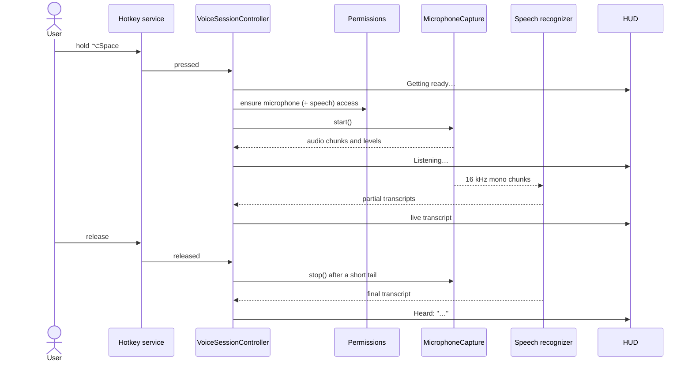
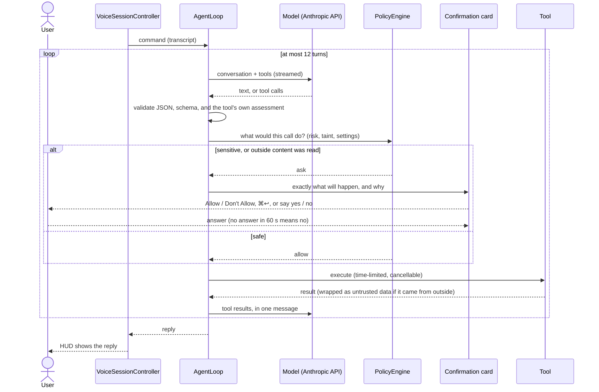

# Voxa

A voice-controlled automation agent for macOS. Hold a hotkey, speak a command, and Voxa carries it out on your Mac using
an LLM with tool calling, then shows and speaks the result. It lives in the menu bar, listens only while you hold the
key, and transcribes your voice on the Mac. The model can be Claude, OpenAI's GPT, or a model that runs on your own Mac
through Ollama.

> **Status: milestone 3 of 5.** Hold the key, speak, and Voxa carries the command out with an LLM and tools for apps and
> links, Shortcuts and AppleScript, your calendar and reminders, the clipboard and the app in front, asking your permission
> for anything that isn't safe, and answering aloud. A welcome guide sets up permissions and the model on first launch, and
> Settings has a switch for every tool, a Permissions page and the history of what Voxa did. On-screen control (clicking and
> typing in other apps), screenshots and the optional Whisper engine arrive in later milestones. See [Roadmap](#roadmap).

## Requirements

- macOS 14 or later (macOS 26 recommended: it enables Apple's newer speech engine and the Liquid Glass HUD)
- Xcode 26 / Swift 6.2 to build
- [XcodeGen](https://github.com/yonaskolb/XcodeGen) only if you change `project.yml` (`brew install xcodegen`)
- A Developer ID certificate only for signed, notarized distribution

## Quick start

```bash
make run          # builds Voxa.app (Debug, ad-hoc signed) and launches it
```

Look for the microphone icon in the menu bar. On the first launch a **welcome guide** opens: it explains what Voxa does,
asks for the microphone and speech-recognition permissions, and helps you choose a model. (It can be reopened from
Settings → General.) Or do it by hand:

1. **Choose a model**: menu bar icon → **Settings…** → **Model** → pick a provider (see [Models](#models)) → paste its key
   → **Save**. Keys go into the macOS Keychain and nowhere else. (**Test connection** makes a tiny request to check it.
   Until a key is saved, a command answers *Add your OpenAI API key* (or Anthropic's) with a button that opens this page.)
2. **Hold ⌥Space, speak, release.** The first time, macOS asks for Microphone and Speech Recognition access; the HUD
   explains anything that's missing and offers a button that opens the right System Settings pane.

Try: *"open Notes"*, *"open apple.com"*, *"what's on my calendar today?"*, *"remind me to call the bank tomorrow at ten"*,
*"what's 6 times 7, use AppleScript"* (it will ask before running the script).

> **Permissions and rebuilds.** An ad-hoc signature changes on every build, so macOS treats each build as a new app: it asks
> again, and an Accessibility entry left over from an earlier build can show as switched on in System Settings while doing
> nothing. To keep your grants across rebuilds, sign development builds with your Developer ID: `make run-signed`
> (`scripts/build.sh --sign-dev --run`). macOS asks once to let the build use your signing key: choose *Always Allow*.
> If Accessibility says *Not asked yet* although Voxa is on in the list, select Voxa there, press **−** to remove it, and press
> **Allow…** in Voxa again.

## Models

Pick one in **Settings → Model**. Everything after the model (the agent loop, the policy, the confirmation card, the tools)
is identical for all three, so the safety rules don't depend on which one you use.

| Provider | You need | Default model | Notes |
|----------|----------|---------------|-------|
| **Claude** | An Anthropic API key (`sk-ant-…`) | `claude-sonnet-5-5` | Messages API |
| **OpenAI** | An OpenAI API key (`sk-…`, the one you would put in `OPENAI_API_KEY`) | `gpt-6-luna` | Responses API; Voxa asks OpenAI not to store the conversation. Any model that can use tools works |
| **Ollama** | The [Ollama](https://ollama.com) app running, and a model that can use tools | none (you choose) | Runs on your Mac: the text of your command never leaves it. Default address `http://localhost:11434` |

- **A GUI app doesn't see your shell's environment,** so paste the key into Settings rather than exporting `OPENAI_API_KEY`.
  Voxa reads it from the Keychain only. (`voxa-dev`, the command-line tool, does read `OPENAI_API_KEY` / `ANTHROPIC_API_KEY`.)
- **Ollama models must support tool calling.** Settings lists what the server has and warns about a model that can't call
  tools (for example `gemma2`); `qwen3` and `llama3.1` can. Install one in Terminal: `ollama pull qwen3:8b`. Small models
  are quicker but less reliable at picking the right tool; the policy still asks before anything risky, whichever you use.
- **Cloud models in Ollama** (names ending in `-cloud`) run on Ollama's servers, so what you say leaves the Mac. Settings
  marks them.
- The **context window** for Ollama defaults to 16,384 tokens, because Ollama's own default would silently cut off Voxa's
  instructions and tool list. Raise it in Settings if you use long clipboard or file contents later on.
- Try a key or a model without the app: `voxa-dev chat "say hello" --provider openai` (also `--provider ollama --model qwen3:8b`).

## What Voxa can do

Every tool has a switch in **Settings → Tools**; a tool that is off is hidden from the model and refused if called anyway.

| Tool | What it does | How it is treated |
|------|--------------|-------------------|
| Open apps, open links | Opens an app or a web page | Runs, and tells you |
| List and run Shortcuts | Runs one of your Shortcuts | **Always asks** |
| Run AppleScript | Runs a script you read first | **Always asks**; shell routes are refused |
| Read your calendar | Lists events for a day or a week | Runs; what it returns is untrusted data |
| Add a calendar event | Adds one (never invites anyone) | Runs, and tells you |
| Change or delete a calendar event | Moves, renames or removes one occurrence | **Always asks**; warns if others are invited |
| Read your reminders, add a reminder | Lists what is due, adds one | Read runs; add tells you |
| Read the clipboard | Reads the text you copied | Tells you; untrusted; **never** something a password manager marked secret |
| Copy to the clipboard | Puts text there for you to paste | Tells you |
| See what's in front | The front app, and with Accessibility its window title and your selection | Runs; title and selection are untrusted |

## Using it

| You do | Voxa does |
|--------|-----------|
| Hold ⌥Space | HUD appears near the top of the screen: *Listening…*, a level meter and the live transcript |
| Release | Records a fraction of a second more (so the last word isn't clipped), then *Transcribing…*, then *Thinking…* while the model works and the name of each action while it runs |
| A risky action comes up | A card shows exactly what will happen (the whole script, the address, the app) and why Voxa is asking. **Allow** / **Don't Allow**, **⌘↩** to allow, or hold ⌥Space and say *yes* or *no*. Esc stops the whole command. No answer in 60 seconds counts as *no* |
| The reply | A short answer stays up for a few seconds and is **read aloud** (switch it off in Settings → General → Voice). Holding ⌥Space or pressing Esc stops the speech at once. Hold ⌥Space within two minutes for a follow-up ("make it three hours") |
| Tap the key briefly | A hint: *Hold ⌥Space while you speak*. Push-to-talk needs a hold |
| Press Esc | Cancels the command at any point (listening, thinking, or waiting on a question) and dismisses; while a reply is showing, Esc dismisses it |
| Say nothing | *I didn't catch that* |
| Deny a permission | An error naming the permission with a button that opens System Settings |

The HUD never steals focus from the app you're working in. Change the shortcut or the recognition language in
**Settings…** (menu bar icon).

## Project layout

See [docs/DESIGN.md](docs/DESIGN.md) for the full design. In short: all logic is a Swift package of small modules
(`VoxaCore`, `VoxaAudio`, `VoxaSpeech`, `VoxaPermissions`, `VoxaHUD`, `VoxaSettings`, `VoxaLLM`, `VoxaPolicy`, `VoxaTools`,
`VoxaAgent`, `VoxaApp`); the Xcode project only wraps `VoxaApp` in an app bundle with the Info.plist, entitlements and signing.

**From key press to recognized text**



**From recognized text to a done thing**



## Permissions

| Permission | Used for | When it is asked |
|------------|----------|------------------|
| Microphone | Hearing your command | First push-to-talk, or from the welcome guide |
| Speech Recognition | Apple's classic on-device recognizer (not needed by the newer engine) | First push-to-talk, only if that engine runs |
| Calendars, Reminders | The calendar and reminders tools | The first time a command needs one, or ahead of time from Settings → Permissions |
| Accessibility | The front window's title and your selected text (`get_frontmost_context`) | Only from the welcome guide or Settings → Permissions, never in the middle of a command |
| Automation | `run_applescript` controlling another app | The first time a script talks to that app (macOS asks per app) |
| Screen Recording | Looking at the screen (milestone 4) | Not used yet |

Voxa asks macOS at the moment a tool needs a permission, and the command's clock stops while the prompt is up. If you have said
no, the command ends with a message and a button that opens the right System Settings pane, rather than the model
being asked to write around it. **Settings → Permissions** shows all of them at once with a button on each, and a row turns green
when you come back from System Settings.

Speech recognition is always on-device. If a language has no on-device model, Voxa says so and tells you how to install
one rather than sending audio to Apple's servers.

## Security model

Voxa can act on your Mac, so the design assumes that anything it reads may be hostile, and that the model can be fooled.
The policy engine is the security boundary (the app can't be sandboxed: Accessibility and Apple Events need it), and it is
exhaustively tested. The rules, all in force in this milestone:

- **Push-to-talk only.** The microphone is open only while the key is held; macOS shows its orange indicator meanwhile. A
  spoken *yes* also needs the hold, so audio from a video or another voice can't approve anything.
- **Only your spoken command is an instruction.** Script output (and later the screen, clipboard, files, web pages) is *data*:
  it reaches the model wrapped in a random-boundary envelope, stripped of invisible characters, and can't close its own
  envelope. The system prompt tells the model to treat it as data.
- **Three risk tiers, decided by code, not by the model.** Read-only actions run; reversible ones run with a notice;
  sensitive ones (running scripts and Shortcuts, later deleting, sending, moving files) **always** ask. Risk only goes
  *up*: the highest of what the tool says, what the policy says about that tool, and what the call turns out to be. The
  model can't pass a "risk" or "confirmed" argument; the tool schemas forbid extra arguments and every call is validated
  against them.
- **Untrusted content raises the bar.** After the model has read anything from outside your command, even reversible
  actions ask, and the card says why. (In testing, a script whose output told the model to open a hostile link did fool the
  scripted model. The link was not opened without a prompt, and declining it ended the attempt.)
- **You see the real thing.** The card is written by the tool's own code from the validated arguments: the whole script,
  the exact address, the app. Hidden and text-direction characters are shown as visible markers.
- **No shell.** There is no arbitrary-command tool. AppleScript that reaches for `do shell script`, Terminal, other scripts,
  Objective-C bridging or remote machines is refused before you are asked. This is a speed bump, not a sandbox: an AppleScript
  is always sensitive precisely because *you* reading it is the real check.
- **Links are vetted.** Web, mail, phone, message and map links only; never `file:` or a custom scheme; credentials in an
  address, backslashes and encoded host names are refused; local-network addresses, bare IPs, look-alike names and
  data-stuffed addresses need your OK.
- **Bounded.** At most 12 steps, 30 seconds per action, 2 minutes per command (not counting time spent deciding), and two
  refusals end the command. Esc stops everything, including a running script.
- **Append-only audit log** of commands, tool calls, decisions and your answers: `~/Library/Application Support/Voxa/audit.jsonl`
  (private to you, JSON Lines, capped at 5 MB). It holds no tool output and no key. **Settings → History** shows it grouped by
  command, with a search, *Show in Finder* and *Clear History*: the only way anything is ever removed from it.
- **Your calendar, reminders, clipboard and screen are outside content.** Whatever they return reaches the model as untrusted
  data, and once it has, even reversible actions ask (an invitation from a stranger can carry an instruction). The clipboard tool
  honors the convention password managers use and never returns something marked secret. A tool's permission is checked *before*
  the tool describes what it will do, so nothing reads your calendar without access.
- **Secrets.** Each API key lives in the Keychain only (one entry per provider, this device only, never synced). Logs never
  contain keys, transcripts or tool payloads at the default level. A key is only ever sent over `https` (or to this Mac, for
  a local test server): a server address in Settings that isn't, silently falls back to the provider's own, so a bad setting
  can't hand your key to another host.
- **What is sent, and to whom.** The text of your command, the tool definitions, and the results tools return go to the
  provider you chose: Anthropic, OpenAI (with `store: false`, so nothing is kept for later lookup), or your Ollama server. With
  Ollama on this Mac nothing leaves it; an Ollama server on another machine, or a cloud model, is your own choice and Settings
  says so. Your voice never leaves the Mac. Ollama takes no key; its address may be `http` because it is usually on this Mac.

## Development

```bash
make test         # unit tests (808 of them, ~10 s: includes real-window tests, a real osascript and a real speech voice)
make lint         # SwiftLint
make format       # SwiftFormat
make snapshots    # render the HUD in every state, light and dark, to build/snapshots
```

### Developer tools

`swift run voxa-dev <command>` exercises the building blocks without a person or a microphone:

```bash
say -o /tmp/clip.aiff "open safari and search for swift concurrency"
swift run voxa-dev speech-status                       # what each speech engine can do on this Mac (downloads nothing)
swift run voxa-dev transcribe /tmp/clip.aiff           # run an engine over a file
swift run voxa-dev system-prompt                       # print the agent system prompt exactly as sent
swift run voxa-dev ask "open example dot com" --dry-run  # a typed command through the real model client, agent loop and tools
swift run voxa-dev ask "open safari" --provider openai --dry-run                    # …with OpenAI ($OPENAI_API_KEY)
swift run voxa-dev ask "open safari" --provider ollama --model qwen3:8b --dry-run   # …with a local model
swift run voxa-dev chat "say hello" --provider openai   # one plain model call, no agent: does my key / model work?
swift run voxa-dev ollama                               # what an Ollama server has, and what each model can do (read-only)
```

`voxa-dev ask` (with `--sample-data` for the calendar and clipboard tools) needs a key (`--key`, or `$ANTHROPIC_API_KEY` / `$OPENAI_API_KEY`; Ollama needs none) or the mock server below.
`--confirm yes,no` answers the first prompt yes and the second no (default: ask at the terminal). `--dry-run` prints what
`open_app` / `open_url` would open. Keys are used to build the client and never printed.

### Testing without a key: the mock model server

```bash
scripts/mock-llm-server.py --port 8899 --log /tmp/mock.jsonl &      # a stand-in for all three model APIs
swift run voxa-dev ask "add numbers" --base-url http://127.0.0.1:8899 --confirm yes                       # Claude
swift run voxa-dev ask "add numbers" --provider openai --base-url http://127.0.0.1:8899/v1 --confirm yes   # OpenAI
swift run voxa-dev ask "add numbers" --provider ollama --model qwen3:8b --base-url http://127.0.0.1:8899 --confirm yes
```

One server speaks Anthropic's Messages API, OpenAI's Responses API and Ollama's native chat API. It validates each request as
the real service would (headers, tool-result adjacency, sorted tools, parameters a model rejects, OpenAI's message `phase`,
Ollama's context window and tool support) and answers by keyword (see its header): `add numbers` (a script that needs
confirmation), `inject` (a script whose output tries to redirect the model), `shell` (must be blocked), `unauthorized`,
`quota`, `overloaded`, `cutoff`, `refuse`, `slow`. It pretends to have four Ollama models, one of which can't use tools.

Two scripts run the real Debug app against it, with settings in a throwaway preferences domain (yours are untouched) and
no system prompt ever appearing:

```bash
scripts/build.sh
scripts/e2e-providers.sh      # Claude, OpenAI and Ollama: a confirmation, the audit trail and every request
scripts/e2e-tools.sh          # calendar, reminders, clipboard and context tools on sample data, an invitation with a hidden
                              # instruction, the permission gate, spoken replies (one short sentence is said aloud), the walkthrough
```

`e2e-tools.sh` uses two Debug-only variables: `VOXA_DEBUG_SAMPLE_DATA=1` (or `hostile`, which adds an event whose title tries to
steer the model) makes the tools use made-up data, and `VOXA_DEBUG_TOOL_PERMISSIONS=calendars=denied,reminders=notDetermined`
scripts the answers the permission gate gets.

### Debug builds

Debug builds add a **Debug: preview HUD** submenu, and the app listens for Darwin notifications so the HUD and windows can
be driven from a shell (no microphone, no key press):

```bash
notifyutil -p com.rohitsainier.voxa.debug.hud.listening      # also: partial long transcribing result notice error errorPlain hide
notifyutil -p com.rohitsainier.voxa.debug.settings           # open Settings (…settings.close, …settings.tracking, …settings.tab.model|tools|permissions|history…)
notifyutil -p com.rohitsainier.voxa.debug.onboarding         # open the welcome guide (…onboarding.step.N, …onboarding.close)
notifyutil -p com.rohitsainier.voxa.debug.key.down           # inject the push-to-talk key down / up (…key.up) into the real pipeline
notifyutil -p com.rohitsainier.voxa.debug.hud.confirmScript  # also: thinking acting reply replyLong confirmURL confirmTaint confirmLong
swift scripts/window-info.swift Voxa                          # window level, frame and visibility of the running app
```

To drive the whole agent against the mock server, with no key, no microphone and a private audit file:

```bash
open -n --env VOXA_ANTHROPIC_BASE_URL=http://127.0.0.1:8899 --env VOXA_DEBUG_API_KEY=sk-ant-mock \
    --env VOXA_DEBUG_OPENAI_API_KEY=sk-mock --env VOXA_DEBUG_DEFAULTS_SUITE=com.rohitsainier.voxa.e2e \
    --env VOXA_DEBUG_COMMAND_FILE=/tmp/cmd.txt --env VOXA_DEBUG_REPORT_FILE=/tmp/report.txt \
    --env VOXA_DEBUG_AUDIT_PATH=/tmp/audit.jsonl build/DerivedData/Build/Products/Debug/Voxa.app
echo "add numbers" > /tmp/cmd.txt; notifyutil -p com.rohitsainier.voxa.debug.ask     # submit the command
notifyutil -p com.rohitsainier.voxa.debug.key.allow      # ⌘Return   (also: key.escape, button.allow, button.deny, button.recovery, answer.yes / no / unclear)
notifyutil -p com.rohitsainier.voxa.debug.report; cat /tmp/report.txt                # status, which keys are captured, permissions
```

`VOXA_DEBUG_DEFAULTS_SUITE` keeps the app's settings in a separate preferences domain (write the provider, model and address
there instead of clicking through Settings; `scripts/e2e-providers.sh` shows how). OpenAI's and Ollama's addresses are
ordinary settings, so they need no variable.
These variables are compiled out of Release builds, which always use the Keychain, Anthropic's own endpoint and your own
preferences.

To check speech recognition without speaking, hold the injected key while the Mac talks to its own microphone, and have the
app write what it heard to a file (Debug builds only, opt-in):

```bash
open -n --env VOXA_DEBUG_TRANSCRIPT_FILE=/tmp/heard.txt build/DerivedData/Build/Products/Debug/Voxa.app
notifyutil -p com.rohitsainier.voxa.debug.key.down; say "open safari"; notifyutil -p com.rohitsainier.voxa.debug.key.up
sleep 1; cat /tmp/heard.txt
```

### Logs

```bash
/usr/bin/log show --last 10m --info --predicate 'subsystem == "com.rohitsainier.voxa"'   # what happened
/usr/bin/log stream --predicate 'subsystem == "com.rohitsainier.voxa"' --level debug      # watch live
```

(Use the full path: in zsh, plain `log` is a shell builtin and fails silently.) Every press and release of the shortcut
leaves a line (`push-to-talk key down` / `key up`), and each command's outcome is logged without its content.

Transcripts are never logged at the default level; at debug level they are marked private.

### Known pitfalls

- **Never size a window through Auto Layout** (`NSHostingController` `.preferredContentSize` and friends). On macOS 26
  it makes AppKit throw inside its layout pass; this crashed Settings. A lint rule enforces it; see the design doc.
- **`swift build` cannot produce a working `.app`**: SwiftPM's resource accessor expects resource bundles at the app's
  root, which code signing rejects. Build the app with Xcode (`scripts/build.sh`); use `swift test` for the logic.
- **Carbon hotkeys** cannot be modifier-only keys, and another app may already own ⌥Space (Voxa can't tell). Pick a
  different shortcut in Settings if the key does nothing. ⌥⌘Space (Command+Option+Space) is macOS's own *Show Finder
  search window* shortcut and never reaches Voxa; the default is ⌥Space (Option+Space).
- **Don't poll key state.** `CGEventSource.keyState` reads every key as up without Input Monitoring permission; a
  watchdog built on it once cut every hold to ~100 ms. Diagnose shortcut trouble with the log breadcrumbs instead.

## Manual QA checklist

Automated tests cover the state machine, audio conversion, the model client, the agent loop, the policy and window behavior,
and the app has been driven end to end against a mock API server. These need a person, real hardware, macOS permissions and
a real API key:

- [ ] Launch: a microphone icon appears in the menu bar; the menu reads "Ready — hold ⌥Space to talk".
- [ ] First press: the Microphone prompt appears; after Allow, and the Speech Recognition prompt, holding ⌥Space works.
      (If you released the key while a prompt was up, the HUD says *You're all set*.)
- [ ] Hold and speak: the HUD shows *Listening…*, the meter moves with your voice, words appear live.
- [ ] Release: *Transcribing…*, then *Heard* with the final text; the HUD fades out after about three seconds.
- [ ] Quick tap: the HUD says *Hold the shortcut while you speak*, then fades; no error, and no orange microphone dot left behind.
- [ ] Esc while listening: the HUD disappears and the orange microphone dot goes away immediately.
- [ ] Esc while a result is showing: dismisses it. Esc elsewhere, when no HUD is showing, still reaches your app.
- [ ] Say nothing: *I didn't catch that*.
- [ ] Deny Microphone in System Settings, then press: an error with **Open System Settings** that opens the Microphone pane.
- [ ] Focus: keep typing in another app while the HUD shows; the app stays active and no keystroke is lost.
- [ ] A full-screen app: the HUD still appears over it. Two displays: it appears on the one with the pointer.
- [ ] Light and dark mode; VoiceOver announces *Listening* and the recognized command.
- [ ] Settings: opens without a crash (repeatedly); changing the shortcut takes effect and the menu label follows.
- [ ] AirPods or another Bluetooth mic: connect one, press, speak; the command survives the audio format switch.
- [ ] Recording limit: hold the key for a minute; recording stops on its own.
- [ ] Newer speech engine (macOS 26): after the first command the model downloads in the background (check
      `swift run voxa-dev speech-status`); later commands use it. Turning off the Settings toggle prevents the download.

**Milestone 2: needs your API key and your Mac**

- [ ] Settings → Model: paste a key, Save (the field clears, "A key is saved in your Keychain"), **Test connection** says
      *Connected*. Remove it: the next command says *Add your Anthropic API key* with a working button.
- [ ] *"Open Notes"* opens Notes, the HUD shows *Thinking…*, then *Open Notes*, then a short reply. No question is asked.
- [ ] *"Open apple.com"* opens the page in your default browser. *"Open apple.com in Safari"* uses Safari.
- [ ] *"Run an AppleScript that returns 6 times 7"*: a card shows the whole script and **Allow / Don't Allow**. Allow → the reply
      says 42. Try each way to answer: click, **⌘↩**, and hold ⌥Space and say *yes* (and once *no*, and once something unclear).
- [ ] A plain Return (typing in another app while a card is up) does **nothing** to the card. ⌘↩ only works about half a second
      after the card appears.
- [ ] *"Use AppleScript to tell Finder to activate"*: macOS asks for **Automation** permission for the first time, naming Voxa.
      After Allow, the script runs; after Don't Allow, the reply explains it needs the permission.
- [ ] Ask for something impossible ("run a shell command"): a plain refusal, never a prompt.
- [ ] Esc while *Thinking…*, while a script runs and while a card is up: each stops the command and clears the HUD at once.
- [ ] A follow-up within two minutes ("and open Safari too") knows what came before; after two minutes it doesn't.
- [ ] Turn Wi-Fi off and ask for something: *You appear to be offline*, no hang. Turn it on again: the next command works.
- [ ] Settings → Safety → *For every change*: even *"open Notes"* now asks first.
- [ ] Look at `~/Library/Application Support/Voxa/audit.jsonl`: your commands, the tools, each decision and answer, no tool output.
      (Settings → History shows the same thing.)

**Milestone 3: needs your Mac and real permissions** (nothing below has been run against a real calendar, real reminders or a
granted Accessibility permission: the automated checks use sample data and scripted permission answers)

- [ ] First launch: the welcome guide opens. Its permission buttons bring up the real macOS prompts (Microphone, Speech
      Recognition, and if you press them Calendars, Reminders, Accessibility) and the rows turn green as you answer.
- [ ] *"What's on my calendar today?"* with Calendars not yet allowed: the macOS prompt appears, and after Allow the command
      answers from your real calendar. After Don't Allow, the command ends with *Calendars access is off* and a button that opens
      the Calendars pane; turning it on there and asking again works.
- [ ] *"Add lunch with Sam tomorrow at one"* adds a real event on the right day and time (check Calendar), and the reply says
      the day and time back. Try an all-day event (*"…on Friday, all day"*) and a two-day one: they must show as all-day in Calendar.
- [ ] *"Move my dentist appointment to four"* and *"cancel it"* each show a card with the event and ask first; only that one
      occurrence of a repeating event changes. An event with other attendees says so on the card.
- [ ] *"Remind me to call the bank tomorrow at ten"* adds a reminder due at ten that actually notifies (check Reminders).
- [ ] Copy some text, then *"what did I copy?"*: it reads it back and a notice says the clipboard was read. Copy a password from a
      password manager: Voxa says it was marked secret and doesn't read it. *"Copy hello"* replaces the clipboard.
- [ ] Turn Accessibility on (Settings → Permissions), select some text in another app, and ask *"what's selected?"*: it names
      the app, the window title and your selection. With it off, only the app is named.
- [ ] Replies are spoken. Change the voice and speed in Settings → General → Voice and press *Test voice*. Hold ⌥Space while it
      talks: it stops at once. With the switch off, nothing is spoken.
- [ ] Settings → Tools: turn *Open apps* off, ask *"open Notes"*: it is declined. Turn it back on.
- [ ] Settings → General → *Start Voxa when I log in*: turn it on (macOS may ask you to approve it in Login Items), log out and in.
      Turn it off again.
- [ ] Settings → History: your commands appear with what happened; search finds one; *Show in Finder* reveals the file; *Clear
      History…* asks, then empties it.

**Model providers: needs your OpenAI key and/or Ollama with a tool-capable model**

- [ ] Settings → Model → **OpenAI**: paste your key, Save, **Test connection** says *Connected*. *"Open Notes"* works, and
      *"Run an AppleScript that returns 6 times 7"* asks first, exactly as with Claude. (Not yet run against the real OpenAI
      API: the only checks so far are the mock server, which follows OpenAI's published API, and the unit tests.)
- [ ] A wrong OpenAI key: *OpenAI rejected your API key*, with a button that opens Settings on the Model tab.
- [ ] Settings → Model → **Ollama**: *Running (version …)*, your models are listed, and one without tool support shows a warning.
      Choose a tool-capable model; **Test connection** says *Connected* (the first one loads the model, which can take a while).
- [ ] Quit Ollama and give a command: *Ollama isn't running*, with **Open Ollama**. The model list in Settings says so too.
- [ ] Ollama, a model that can use tools: *"open Notes"* works, and an AppleScript still asks first.
- [ ] Switch provider in Settings, then follow up within two minutes: the new provider starts a fresh conversation.

## Roadmap

| | Scope | Status |
|-|-------|--------|
| M1 | Menu-bar shell, hotkey, audio capture, Apple STT, HUD with live transcript | done |
| M2 | LLM client + agent loop, `open_app` / `open_url` / `run_shortcut` / `run_applescript`, policy engine, confirmation HUD | done |
| M3 | Permissions manager + welcome guide, calendar / reminders / clipboard / context tools, spoken replies, full settings, history viewer | done |
| M4 | Accessibility UI tools, screenshot + vision fallback, WhisperKit engine | next |
| M5 | Hardening, signing and notarization scripts, DMG, final docs | |

## License

Not yet licensed. All rights reserved.
