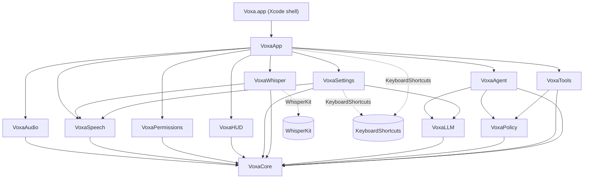

# Voxa design

This is the design record written before implementation and kept current milestone by milestone: module layout, key
protocols, the agent system prompt, and the risks and assumptions behind the decisions. The README covers usage; this
covers *why*.

## 1. Goals and non-goals

**Goal.** A menu-bar macOS app. The user holds a global hotkey, speaks a command, and an LLM with tool calling carries it
out on their Mac, then speaks and shows the result. Push-to-talk only; nothing listens in the background.

**Non-goals for v1.** Mac App Store distribution (Accessibility and Apple Events are impossible in the sandbox), an
arbitrary-shell tool, wake-word activation, cloud speech recognition.

## 2. Module layout

Every target is prefixed `Voxa`. (A module named `Speech` would shadow Apple's framework.) Dependencies point one way:
`VoxaCore` depends on nothing; capability modules depend on `VoxaCore` only; `VoxaApp` composes them; the Xcode app target
is a thin shell around `VoxaApp`.

```
voxa/
├─ Package.swift               libraries, the voxa-dev tool, tests (swift-tools 6.2, Swift 6 mode, ExistentialAny)
├─ project.yml, Voxa.xcodeproj  XcodeGen app shell: signing, hardened runtime, Info.plist, entitlements, icon
├─ App/                         VoxaMain.swift (@main), Info.plist, Voxa.entitlements, Assets.xcassets
├─ Sources/
│  ├─ VoxaCore/          shared kernel: AudioChunk, UserFacingError, L10n, Log, AppSettings, PermissionKind, HotkeyService,
│  │                     JSONValue, Schema, AgentTool/ToolResult/RiskLevel, ConfirmationPrompt, AuditEntry, JSONLAuditLog
│  ├─ VoxaAudio/         AudioCapturing, MicrophoneCapture (AVAudioEngine), SpeechFormatConverter, LevelMeter
│  ├─ VoxaSpeech/        SpeechRecognizer; SFSpeechRecognizer + SpeechAnalyzer engines; [M4] WhisperRecognizer (the engine-agnostic
│  │                     streaming around any Whisper), WhisperModelsModel (what Settings' model list drives)
│  ├─ VoxaWhisper/ [M4]  the one module that carries WhisperKit: model storage and "ready" markers, download + prepare, loading and
│  │                     idle unloading
│  ├─ VoxaPermissions/   PermissionsProviding, SystemPermissionsManager (asks for every kind), PermissionsModel (rows, polling)
│  ├─ VoxaVoice/  [M3]   text to speech: SpeechSynthesizing, AVFoundationSpeaker, voice choice, text made ready to be said
│  ├─ VoxaHUD/           non-activating NSPanel + SwiftUI HUD: listening, thinking, acting, confirmation card, reply
│  ├─ VoxaSettings/      SettingsStore, six tabs (General incl. voice and login, Model, Tools, Permissions, Safety, History),
│  │                     window controllers for Settings and the first-run walkthrough, Ollama status
│  ├─ VoxaLLM/    [M2]   Model clients over URLSession, one per provider (Claude, OpenAI, Ollama) behind RoutingLLMClient;
│  │                     shared streaming engine (SSE / NDJSON, retries, cancellation), request builders, key storage
│  ├─ VoxaPolicy/ [M2-4] PolicyEngine, untrusted-data envelope, AppleScript and URL analyzers, voice yes/no parser; [M4] AppSafety
│  │                     (apps that are off limits), UILabelRisk (labels that send or delete), FilePathPolicy (which files may change)
│  ├─ VoxaTools/  [M2-4] open_app, open_url, list_shortcuts, run_shortcut, run_applescript; calendar_* (4), reminders_* (2),
│  │                     clipboard_* (2), get_frontmost_context; [M4] ui_inspect, ui_click, ui_type, ui_press_keys, screenshot,
│  │                     file_search, reveal_in_finder, file_move, file_trash; EventKit, pasteboard, Accessibility, CGEvent,
│  │                     ScreenCaptureKit and the file system behind protocols, with a pretend desktop and disk for tests and demos
│  ├─ VoxaAgent/  [M2]   AgentLoop, AgentService, ToolRegistry, ConversationMemory, system prompt + runtime context
│  ├─ VoxaApp/           composition root, VoiceSessionController, ConfirmationCoordinator, hotkey service, menu bar
│  ├─ VoxaDev/           developer CLI: transcribe, speech-status, hud-snapshots, system-prompt, ask, chat, ollama
│  └─ VoxaTestSupport/   ManualClock, fakes, ScriptedLLM, StubTool, MockHTTPTransport, SSE builders, TestSignal
├─ Tests/                        one test target per module
└─ scripts/                      build, sign, notarize, icon, window inspection, mock-llm-server.py, e2e-providers.sh, e2e-tools.sh
```



`VoxaAudit` and `VoxaFeedback` (audit viewer, TTS) arrive in M3 beside these, each depending only on `VoxaCore`. The audit
*writer* (`JSONLAuditLog`) already lives in `VoxaCore`.

## 3. Key protocols and types

```swift
// VoxaCore
enum RiskLevel: Int, Comparable, Codable, Sendable { case readOnly, reversible, sensitive }
struct AudioChunk: Sendable { samples: [Float]; sampleRate: Double /* 16 kHz mono */; startTime: TimeInterval }
struct UserFacingError: Error, Sendable { title; detail; recovery: RecoveryAction? }   // never fail silently
protocol AgentTool: Sendable {                                                          // M2
    var name, summary: String; var inputSchema: JSONValue; var baselineRisk: RiskLevel
    var requiredPermissions: Set<PermissionKind>
    func assess(_ input: JSONValue) throws -> ToolAssessment   // validation + risk + preview, written by the tool, never the model
    func execute(_ input: JSONValue, context: ToolContext) async throws -> ToolResult
}
struct ToolResult { content: [text|image]; isError: Bool; provenance: .trusted | .untrusted(source); undo: UndoDescriptor? }

// VoxaAudio / VoxaSpeech
protocol AudioCapturing: Sendable { func start() async throws -> AudioCaptureStreams; func stop() async }
protocol SpeechRecognizer: Sendable {
    func requiredPermissions(locale: Locale) async -> Set<PermissionKind>
    func prepare(locale: Locale) async throws
    func transcribe(_ audio: AsyncThrowingStream<AudioChunk, any Error>, locale: Locale)
        -> AsyncThrowingStream<Transcript, any Error>
}

// VoxaLLM. Raw URLSession: there is no official Swift SDK.
protocol LLMClient: Sendable { func stream(_ request: LLMRequest) -> AsyncThrowingStream<LLMStreamEvent, any Error> }

// VoxaPermissions / VoxaAgent (M3)
protocol PermissionsProviding: AnyObject, Sendable { status(of:), request(_:), openSystemSettings(for:) }   // @MainActor
protocol ToolPermissionGranting: Sendable { func ensureGranted(_ kinds: [PermissionKind]) async -> UserFacingError? }
// VoxaTools (M3): each system touchpoint is a protocol, with the real thing and an in-memory double
protocol CalendarAccessing, RemindersAccessing, ClipboardAccessing, FrontmostContextProviding: Sendable
struct SystemAccess { calendar, reminders, clipboard, frontmost; static func real(); static func sample() }
// VoxaVoice (M3)
protocol SpeechSynthesizing: AnyObject { speak(_:options:), stop(), voices() }   // @MainActor
// VoxaCore (M3): the trail can be read back, separately from being written
protocol AuditReading: Sendable { readAll(), clear(), location, sizeOnDisk() }

// VoxaPolicy / VoxaAgent
struct PolicyEngine: Sendable {   // pure: same call, same state, same answer
    func evaluate(toolName: String, baselineRisk: RiskLevel, assessment: ToolAssessment, taint: RunTaint) -> PolicyDecision
}
enum PolicyDecision { case allow, allowWithNotice(String), requireConfirmation(ConfirmationPrompt), deny(reason: String) }
protocol ConfirmationProviding: Sendable { func confirm(_ prompt: ConfirmationPrompt) async -> ConfirmationOutcome }
enum UntrustedData { static func wrap(_ text: String, source: String, ...) -> String }   // random-boundary envelope
struct AgentLoop { func run(command:, memory:, configuration:, context:, onEvent:) async -> Output }   // result + new memory
actor AgentService { func run(_ command: String, now: Date, onEvent: ...) async -> AgentRunResult }   // owns the conversation
struct AgentLimits { perToolTimeout = 30s; totalTimeout = 120s (not counting confirmations); maxDeclines = 2 }
```

## The agent loop

One spoken command becomes a loop of at most `maxAgentSteps` (default 20, up to 40) model turns. A *step* is one turn of the
model, however many tools it calls in it: calls in one turn run in order and their results go back together, so independent
calls (open, wait, look) sent together cost one step, and the prompt says to send them that way. The command's clock is at least
nine seconds a step (three minutes at 20). When the limit is reached the reply says so and tells the user to say "continue",
which resumes from the same conversation (the follow-up window keeps it):

1. Send the conversation (static system prompt, tools sorted by name, the user turn with the time context) and stream the
   answer. Nothing runs until a *complete* message has arrived, so a failed or dropped request is always safe to repeat.
2. `end_turn`: the text is the reply. `refusal` and `max_tokens`: nothing is executed, even if the partial turn contained a
   tool call. `tool_use`: run the calls, in order, then send **all** their results back in one user message.
3. Each call passes through, in this order: valid JSON (else an `INVALID_JSON` error result, never a guess) → the tool
   exists and is enabled → **`InputValidator`** against the tool's own JSON Schema (`additionalProperties: false`, enums,
   ranges: an extra `"confirmed": true` is an error, not an option) → the tool's own `assess` → **`PolicyEngine`** →
   confirmation if required → execution with a per-tool timeout (abandoned, not awaited, if it hangs) → result.
4. A tool result that isn't Voxa's own text is wrapped in the untrusted-data envelope, and marks the conversation tainted.
5. Limits: a step cap, a per-tool timeout, a total timeout **paused while the user decides**, at most two declines per
   command, and cancellation at every await (Esc). A cut-short run keeps only a plain note of what already happened in the
   conversation, never a tool call without its result.

The conversation is **append-only** while it lives (that is what keeps the prompt cache and the model's signed reasoning
blocks valid) and is discarded whole when it goes stale (`followUpWindowSeconds`), when a setting that shapes the request
changes, or when it grows too long.

### Policy rules

- Effective risk is `max(tool baseline, tool.assess(input), PolicyFloors[tool])`. Nothing can *lower* a tier; the floors are
  the policy's own second opinion, so a tool that mislabels itself as harmless still asks.
- `.sensitive` requires explicit confirmation, whatever the model says or claims the user said. The one thing that lifts that
  is **full control** (below), which is the user's own switch.
- **Taint.** Once untrusted data (script output, later clipboard, screen, files, web text) has been put in front of the
  model, `.reversible` tools also require confirmation, with the reason shown. The taint lasts as long as that content
  stays in the conversation (a whole follow-up session, not one command), because "act on this at the next command" is the
  obvious way past a per-command check. Reads stay allowed; an empty result doesn't taint.
- `strict` asks before every state change, `paranoid` before everything.
- **Full control** (`AppSettings.fullControl`, off by default, Settings → Safety). When on, a call that would have asked is
  allowed instead, as `PolicyDecision.allowByFullControl(notice:wouldAsk:)`: the loop runs it, the HUD shows its title as for any
  action, and the audit trail records `policyDecision … auto` with what the question would have said, which History shows as
  "ran without asking (full control)". It changes *questions only*. It is applied after the refusals, so a disabled tool, a
  call the tool blocks (a password field, a hidden path, a script that reaches for a shell) and an app on the untouchable list
  are refused exactly as before. **Nothing else keeps asking**: scripts (`run_applescript`, `run_shortcut`) and the apps the
  app list says change the Mac itself (System Settings, Disk Utility, Activity Monitor…) run like everything else. (An earlier
  version kept those two asking; the user said that would leave it a manual agent, not an automation agent, so they were removed.)
  The script analyzer's refusals still apply, and with full control on it is the only check on a script: a speed bump, not a
  sandbox. The flag is copied into `AgentRunConfiguration`
  at the start of a command, like the other settings, so a command never *gains* full control part-way; but `AgentLoop` also asks
  `fullControlStillOn` before each call, so switching it *off* (the menu-bar item, Settings) takes effect from the next action
  instead of letting the command run to the end under the old setting. It never comes from the model or from anything read. Voxa's own bundle identifier is on the untouchable list, and scripts can't name Voxa, so its own tools
  can't click through its Settings to turn it on. The model is told (a line in the per-turn `<context>` block, not in the
  static system prompt) that confirmations are off and to take extra care.
- Only the tool and the app decide risk; the model cannot pass a "risk" or "confirmed" argument (the schema forbids it).
- The confirmation shows what the *tool's code* says the call will do (title, exact arguments, target app, reasons), with
  invisible and text-direction characters made visible, so a model-written summary can never hide what will happen.
- `run_applescript` refuses, before anyone is asked: `do shell script`, `run script`, `load script`, Terminal/iTerm/Script
  Editor/Automator/Shortcuts Events/Keychain Access, Objective-C bridging, raw event codes, remote machines, `open location`,
  password-phishing dialogs, targets it can't read (`tell application (expression)`), invisible characters, unterminated
  quotes. It reads the script the way AppleScript does (comments, continued lines, strings; verified against `osascript`).
  **This is a speed bump, not a sandbox.** The real gate is the user reading the whole script.
- `open_url` allows web, mail, phone, message and map links only; blocks `file:`, custom schemes, credentials in the address,
  backslashes and encoded hosts; makes local-network and raw-IP addresses, look-alike (IDN) names and data-carrying
  addresses sensitive.

### Confirmation

Three ways at once, whichever comes first: the **Allow / Don't Allow** buttons, **⌘Return** (Esc stops the whole command),
or a spoken **yes / no** (hold the push-to-talk key and say it; only a whole, plain yes approves, anything else waits).
Silence for 60 seconds is a refusal. For the first 400 ms neither Allow nor ⌘Return works, and ⌘Return isn't even
registered as a global shortcut until then.

*Why ⌘Return and not Return:* a global shortcut swallows the keys it matches. In the first live test a plain Return, typed
for another reason, approved a pending action. The keyboard answer is now a chord that isn't typed by accident, and only
exists while a prompt is up.

### LLM client notes

Checked against the Claude API documentation while designing:

- Default model `claude-sonnet-5-5` (a setting). It rejects `thinking: {type: "disabled"}`, `budget_tokens`, non-default
  sampling parameters and forced `tool_choice`, so the request builder is **model-aware** and sends `effort` and
  adaptive thinking only where the model supports them, defaulting to the smallest request that works everywhere.
- The system prompt is byte-stable and marked for prompt caching; anything volatile (date and time) is placed in the user
  turn, so the cached prefix survives every step of every command.
- `stop_reason: "refusal"` is handled as a first-class outcome. Errors and SSE `error` events are retried with backoff
  (honoring `retry-after`) only while no side effect has happened.
- All `tool_result` blocks for one assistant turn go back in a single user message; skipped calls get an `is_error` result.

### Model providers

Claude, OpenAI and Ollama are three implementations of one small protocol (`LLMClient.stream(_:)`), chosen per request by
`RoutingLLMClient` from `LLMRequest.provider`. The agent loop, the policy and the tools only see neutral types (`LLMRequest`,
`ContentBlock`, `LLMStreamEvent`), so nothing above the client knows which service answered.

```
AgentLoop ──LLMRequest(provider, model, endpoint, contextLength)──▶ RoutingLLMClient ──▶ AnthropicClient
                                                                        │             ├▶ OpenAIClient
                                                                        │             └▶ OllamaClient
                                                                        └── wraps failures in ProviderFailure(provider, error)
each client = StreamingEngine (retries, backoff, cancellation, .restarted) + a wire session:
              request builder ─ what to send      stream translator ─ how to read it      error mapping ─ what went wrong
```

- **`StreamingEngine`** owns what every provider needs: the attempt loop, backoff honoring `retry-after`, cancellation that
  reaches the socket, and `.restarted` when a retry follows a partial answer. A provider supplies an `LLMWireSession`: how
  to build the request, how to decode the body (`SSEStreamDecoder` or `JSONLineStreamDecoder`), how to map an error, and
  `adapt(to:)`, which drops an optional parameter the server rejected and repeats the request.
- **Failures are worded for the service that failed** (`ProviderFailure` → "OpenAI is busy", "Ollama isn't running"), and
  recovery buttons go where the fix is: *Open Settings* lands on the Model tab, *Open Ollama* launches the app.
- **A conversation belongs to one provider.** The history fingerprint includes provider, address and context window, so
  switching starts fresh (Claude's signed thinking blocks mean nothing to another service).

**OpenAI** (Responses API, stateless):

- `POST {base}/responses` with `store: false`, `instructions`, `input` items and function tools with `strict: false` (the API
  defaults `strict` to true, which demands every property be required; Voxa's tools have optional arguments and validate
  their own input). `reasoning.effort` goes only to reasoning models, and is dropped and retried if the server refuses it.
- **Reasoning items are not replayed.** OpenAI recommends passing them back within a tool loop for best results, but a
  replayed reasoning item must keep its `id`, `encrypted_content` and following item as a matched set, and getting that wrong
  is a 400 on every multi-step command. Voxa keeps the simpler, robust form (function calls are sent without an `id`) and
  accepts slightly less continuity of reasoning between steps. Revisit this once it can be tried against a live key.
- **Message `phase`** (`commentary` before a tool call, `final_answer` for the closing answer) is sent back on assistant messages
  for `gpt-5.3` and later, as OpenAI asks ("dropping it can degrade performance"). It is reconstructed from the history's
  shape, and dropped and retried if a server refuses it.
- `insufficient_quota` (out of credit) is its own, non-retried error: it is a 429, but waiting won't fix it.
- The idle timeout is 60 s, because a reasoning model can be silent while it thinks.

**Ollama** (native `/api/chat`, newline-delimited JSON):

- The native API rather than the OpenAI-compatible one, because it takes what a voice assistant needs: `options.num_ctx`
  (Ollama's default context is small enough to silently cut off Voxa's prompt and tools), `keep_alive` (30 minutes, so only
  the first command pays the load time) and `think`.
- Tool calls arrive whole and have **no id**; Voxa makes one up (`call_<hex>`) so the result can be matched, and sends results
  back by `tool_name`. Tool-call arguments are an object, not a JSON string.
- `think` is negotiated per model from `/api/show` (cached for ten minutes): switchable models get `think: false` when the
  setting is *Quick*, named-level models get the matching level, others get nothing; a 400 that mentions thinking drops it.
- A model that can't call tools is reported by name ("gemma2:2b can't call tools…"), not as a generic failure; a missing
  model says how to install it; a server that isn't there says to open Ollama. A local model gets a five-minute clock per
  command instead of two, since it may have to load first.
- The address may be `http` on any host (the user's own home server, say): no key is sent, but the conversation is, so the
  choice is theirs. Cloud models (`remote_host` in `/api/tags`) are flagged, since they leave the Mac.

### Permissions (M3)

- **The gate sits in the agent loop, before the tool describes its call.** A tool declares `requiredPermissions`; the loop asks
  a `ToolPermissionGranting` (the real permissions manager in the app) before `assess`, because what a tool reads to describe a
  call (the event about to be deleted) needs the permission too. A permission not yet asked about is requested (the command's
  clock is paused while the prompt is up). One that was refused **ends the command** with the standard permission error, whose
  button opens the right System Settings pane. A model's sentence can't carry a button, and there is nothing else useful for it
  to do. Esc during the prompt cancels the command: the tool must not start (a test caught that it once did).
- **Automation is not gated.** It is granted per target app when a script first controls it, so it can't be asked for ahead of
  time; `PermissionKind.isPerApp` keeps it out of the gate, and the tool explains a -1743 error instead.
- **Accessibility is never requested in the middle of a command.** Granting it means leaving for System Settings, so the
  tool that can use it (`get_frontmost_context`) works without it and says what it is missing; the walkthrough and the
  Permissions tab are where it is asked for.
- The Permissions tab polls once a second while it is on screen and on becoming active: macOS sends no notification when a
  switch is flipped in System Settings.

### Calendar, reminders, clipboard and context tools (M3)

- **Everything they read is untrusted.** Event titles and notes come from whoever sent an invitation; reminder titles from a shared
  list; the clipboard from wherever it was copied; window titles and selections from other apps. Each result is marked
  `untrusted`, which taints the conversation: afterwards even reversible actions ask. There is an end-to-end test with an
  invitation whose title tells the model to open a hostile link: the link is put to the user, not opened.
- **Results echo only what Voxa or the model wrote.** `calendar_update_event` reports what it was asked to change, never the event's
  stored title, so a hostile title can't come back through a "trusted" channel.
- **Risk.** Read-only: list events, list reminders, front app. Reversible (a notice, or a question under strict settings or after
  taint): add an event, add a reminder, read and write the clipboard. Sensitive (always asks): change or delete an event. The
  policy has a floor for each by name, so a wrong self-classification can't lower the bar. `clipboard_read` is reversible rather
  than read-only because it sends what you copied to a model provider, and that deserves a visible notice.
- **Dates** travel as ISO 8601 with a UTC offset in both directions, so there is no guessing about time zones; a time with no
  offset is the user's clock and a bare date means the whole day (an all-day event).
- **Events are named by `id` and `start`.** Every occurrence of a repeating event shares its identifier, so a change or delete gives
  both (copied from `calendar_list_events`), and only that occurrence is touched. An all-day event's end is expressed as the start of
  the day after (EventKit stores it as 23:59:59 of the last day; the conversion is at the EventKit boundary only).
- **The clipboard honors `org.nspasteboard.ConcealedType`**: what a password manager marked secret is never returned.
- **EventKit is behind protocols**, with in-memory doubles that ship in `VoxaTools` (not just in tests) so Debug builds can run the
  whole pipeline against sample data. The real implementations are tested only for what can be tested without access (they return
  nothing and error clearly); they have not been run against a real calendar, which needs the user's grant.

### Speaking (M3)

- `AVSpeechSynthesizer`: on this Mac, free, no network. What is spoken: the reply, an error's title, and a confirmation's
  question (so it can be answered without looking). All of it is also on screen.
- **Voxa must never hear itself.** Any press of the shortcut, and Esc, stop the speech before anything else happens. Tests cover both
  at the session level; the real synthesizer is tested by rendering audio to memory (proving a voice exists and makes sound, that
  rate changes length) without playing anything.
- Text is prepared first (`SpokenText`): links become "a link", markdown symbols and lists are removed, long replies are cut at a
  sentence end. The voice is the best installed one for the recognition language unless one is chosen.

### The audit viewer and first-run walkthrough (M3)

- The history reads the same JSONL file, the current one and the one moved aside at 5 MB, grouped into commands (`AuditGrouping`).
  Reading is a separate protocol from writing, so nothing in the agent can read the trail. Clearing asks, and is the only way
  anything is removed.
- The walkthrough (welcome, permissions, model, ready) opens once on a first run and never traps the user: every step can be skipped,
  and the last says plainly what is still missing. Its window is fixed-size, like Settings, for the same reason.

### Driving other apps (M4)

- **Four tools, one shape.** `ui_inspect` (read-only) lists the front window or its menu bar as numbered elements; `ui_click`,
  `ui_type` and `ui_press_keys` act. They all work on **the front app only**: to use another, `open_app` it first. That keeps
  what the card says ("Click “Save” in TextEdit") the same as what happens.
- **References, and checking before acting.** A listing hands out `e1, e2…` valid until the next listing. Before acting, the automation
  looks again: the same app must be in front (by process, not name), the element must still exist with the same label, and a
  click that has to be made with the mouse (the control has no press action) must find the app's own window on top at that
  point (from the window server), so it can't land on something that slid in front. For a click at a point in a *screenshot*, the
  window must not have moved, and what is at that spot (re-read through the Accessibility API) must be what the card described.
- **The card is built from a description the code made.** `assess` calls `describe(target)`, which answers from the listing (or
  reads the point live) and never from what the model wrote. A label that looks consequential (`UILabelRisk`: send, delete,
  buy, allow, quit…, but not "Don't Allow") raises the click to sensitive; so do a line break in typed text, Return in a chat or
  mail app, ⌘Q and other shortcuts with a system-wide meaning (`KeyChord.consequence`), and Return when the window's default
  button has such a label (found through the Accessibility API and refused with "click it instead", which is asked).
- **App restrictions (`AppSafety`).** Terminals, script editors, password managers and the admin-password prompt are refused for
  reading and driving; System Settings, Disk Utility and Activity Monitor make everything sensitive. A hand-kept bundle-ID list,
  described in the code as a second line of defence. The obvious gap is any app not on it; taint and confirmation are what cover that.
- **Never a password field.** Reading one gives no value; typing is refused whether it is named by reference or has the focus;
  plain characters are refused while one has the focus.
- **Results never repeat app text.** "Pressed e12 (button) in Safari" names the reference and the role, not the label.
- **Seams.** The Accessibility API, the window list, synthetic input and the front-app tracker are protocols; `SampleDesktop` is a
  small pretend desktop (a Safari window, its menu bar, a password field, a hostile page on request) that implements all of them, and
  the real `AccessibilityAutomation` runs against it in tests *and* in the app's sample-data mode. What is left untested is the
  thin layer under the seams (`SystemAccessibilityTree`, `CGEventInputSynthesizer`): they are covered for how events and values are
  built, that a missing permission gives empty answers and never a crash, and by the manual checklist for the rest. CGEvents are
  built from a private event source, so the state of the real keyboard isn't mixed in. Layout-aware key lookup uses the
  ASCII-capable layout macOS itself matches shortcuts against.
- **Reading is bounded**: depth, node count and a time budget, because a web page can hold thousands of elements and an app can be slow.

### Screenshots (M4)

- ScreenCaptureKit; the window is captured *as itself* (`desktopIndependentWindow`), so what is on top of it or beside it isn't in
  the picture; the whole-display capture excludes Voxa's own windows. The picture is scaled to at most 1568 px on its longest side and
  encoded as PNG, or JPEG if that is too large; nothing is written to disk.
- **Policy.** One window: reversible (a notice; asks after outside content or under strict settings). The whole screen: sensitive
  (always asks). Password managers and the like are never captured, and the front-app rule applies to the whole-screen version too.
  The result is untrusted (text in a picture is data) and a screenshot taints the conversation like anything else read from outside.
- **Pictures don't outlive their command.** When a command ends, its pictures are replaced by a sentence in the remembered
  history, so they aren't sent to the model again (thousands of tokens each, and a copy of the user's screen) on a follow-up.
- **Clicking into a picture.** Each screenshot is registered (`s1`, `s2`…) with the area it covers, so `ui_click(screenshot, x, y)` maps
  a pixel back to a point on the screen.
- **Ollama models without vision** are told in words that a picture was taken and can't be seen, rather than sent bytes that would
  fail the request.

### Files (M4)

- `file_search` looks by *name* (words that must all appear), in the home folder or one folder in it. Spotlight (`MDQuery`) is
  asked first; if it is unavailable, a bounded walk through the folders answers instead. The search words are reduced to letters,
  digits and a few name characters before they reach the query, so nothing the model wrote can be query syntax. Hidden items, the
  Library and the inside of apps and libraries are left out. Names come back as untrusted data.
- `file_move` and `file_trash` are always sensitive. `FilePathPolicy` first makes the path canonical (`~` expanded, `..` removed,
  parent folders followed through links, the last part kept as itself so a link is moved as a link), then applies plain rules:
  inside the home folder or on an external drive; not hidden or inside a hidden folder; not the Library; not one of the standard
  folders themselves; not inside a package (app, photo library…); not the home folder or a whole drive. The destination is
  followed through links before it is judged, and the same check runs again when the action is carried out, since the disk can
  change while the card is up.
- **Nothing is replaced and nothing is deleted.** A name already taken stops the move (`moveItem` refuses too); the only way a file
  goes is `trashItem`. A lint rule (`no_file_deletion_in_tools`) fails the build if anything in `VoxaTools` calls `removeItem`,
  `unlink` or `rmdir`. Results never repeat a file name. macOS asks separately for access to Documents, Desktop, Downloads and
  so on the first time Voxa touches them; a refusal comes back as one sentence saying where to allow it.
- The real disk is tested on throwaway folders (links, packages, permissions, name clashes) but the real `trashItem` isn't called in
  tests, because it would put something in the user's own Trash.

### Whisper (M4)

- **Why a module of its own.** WhisperKit is a large dependency that most of the app has no business seeing. Only `VoxaWhisper` imports
  it; everything else works with two small protocols in `VoxaSpeech` (`WhisperTranscribing`, `WhisperTranscriberProviding`), so the
  streaming logic and the settings are tested without a model.
- **Streaming from a non-streaming model.** Whisper transcribes finished audio, so the recognizer re-transcribes everything heard so
  far after each second of new audio (a revisable guess, as the `SpeechRecognizer` contract wants) and once more for the final text.
  A spoken command is seconds long, so this is cheap; past 28 s the guesses stop and only the final covers everything. Whole
  recordings that are near silence are never sent (Whisper makes text up for silence), and the sound annotations it emits
  (`[BLANK_AUDIO]`, `(music)`, notes) are stripped.
- **Nothing is downloaded behind your back.** Loading only ever uses a model that is *ready*: downloaded, prepared for this Mac
  (Core ML compiles it for the chip, and the small tokenizer file is fetched, in one "prepare" step) and recorded in a marker. The
  download happens only from the button in Settings, resumable, cancellable, one at a time. Models live in Application Support,
  not Documents (WhisperKit's default, which would ask macOS for access).
- **Memory.** A loaded model is kept while it is in use and let go after ten idle minutes; launching with Whisper chosen loads it in
  the background so the first command doesn't wait.
- **Not verified here:** a real transcription. Doing so needs a model download (about 150 MB for Base), which nobody has approved;
  everything around it is tested, and `voxa-dev transcribe clip.aiff --engine whisper --model base.en --download` is the one command
  that does it.

### Checking that a command is finished (after M4)

**The failure.** *"Play Hanuman Chalisa in YouTube"* opened the search page and replied "I opened YouTube search results"; only a
second command ("Play") did the screenshot and click. The tools could do all of it, but a model treats the first step that
looks like an answer as the answer. Guidance helps (the prompt now says to finish the job, that a results page plays nothing,
and how to play something on YouTube; `open_url` says it only opens the page; a `wait` tool lets it load; `ui_inspect` says
when a browser's page isn't listed), but guidance is a hope. The check is the harness not taking the model's word for it.

**Shape.** A small typed decision at a decision point in the loop, rather than another free-form turn. (Two references from
the user: TypeSafe AI's *Jev*, a small "System One" classification model that returns a typed answer with a probability and is
used as middleware in agent loops, for routing and for checking tool calls; and *Laya-CoreML*, which runs such decision models
on Apple Silicon through Core ML. Neither is a completion checker as such; the idea taken from them is the fast typed gate.)
`CompletionVerifying.verdict(for:configuration:)` answers `CompletionVerdict(isDone, missing, confidence)` from
`CompletionEvidence(command, actions, reply)`. `LLMCompletionVerifier` implements it with the user's own provider and model in a
separate short request: no tools, low effort, one JSON object back. Because it is a protocol, a model that runs on this Mac
could replace it without the loop changing.

**When.** In `AgentLoop`, where the model's turn would end the command (`concludeOrContinue`): only if a tool ran that declares
a `TaskStepKind` of `.opens` (open_app, open_url) or `.acts` (ui_click, ui_type, ui_press_keys, run_applescript, run_shortcut);
tools that only `.looks` (ui_inspect, screenshot) or do the whole job ("add an event", wait) don't count. And not if the model
has itself looked at the result of its last action (`verifiedByLooking`: an action followed by a successful look, the checker
being unable to see the screen either; opening then looking is not enough, the model may have stopped at that page); or was sent
back and answered again with no new step since the last check (it has made its case); the reply doesn't ask the user something;
the user hasn't declined anything; a step and enough time (check timeout + 15 s) remain; fewer than two checks have been made;
the setting is on. Otherwise the reply stands. (First live use: the video was already playing, the check said "not yet" twice
because the click was named "a spot with nothing Voxa can identify", and the model did an extra screenshot before answering. The
looked-at rule, the no-progress rule and the worked examples in the checker's instructions came from that.)

**What it may see.** Only what Voxa knows: the spoken command, the titles of the tool calls that ran (with done/failed) and the
reply, the last two as data inside the untrusted envelope. Never what a tool returned, so page or file text has no path into it.
What it answers is cleaned before it reaches the model (`CompletionVerdict.clean`: one line, 160 characters, and anything that
looks like an address is replaced by "everything the user asked for").

**What it does.** If `!isDone` and `confidence >= 0.5`, the model's early reply and a note from Voxa go into the history (the
note starts "Check:", is a user turn and never a tool result, asks for the user's own command to be finished and nothing else,
and allows "say so if it is done or can't be done") and the loop takes another step. Any tool that follows goes through the
same policy and confirmations as always. It never ends a command early, never adds anything the command didn't ask for, and every
failure (no answer, unreadable answer, timeout, low confidence) leaves the reply as it was. Esc during a check ends the command.
Each check is in the audit trail (`completionCheck`: done / notDone / unsure / unavailable) and History.

### Test hooks that don't reach other copies (M4)

Debug builds react to Darwin notifications (`notifyutil -p com.rohitsainier.voxa.debug.…`), which are system-wide. A test run
sets `VOXA_DEBUG_HOOK_SUFFIX`, which is added to every name, so another Voxa on the same Mac (one being used, or a build from
before this existed) neither hears them nor sends them; the scripts also stop only the copy they started.

## 4. Agent system prompt

`Sources/VoxaAgent/Resources/AgentSystemPrompt.md` (print it with `swift run voxa-dev system-prompt`). It is loaded at
runtime, filled in with the step cap, and kept **static**. Tests pin the safety clauses so an edit can't silently drop one.
`RuntimeContext` renders the per-request facts (date, time zone, locale) as a block in the user turn.

## 5. Assumptions and decisions

| # | Decision | Why |
|---|----------|-----|
| A1 | The app is built by an Xcode project (XcodeGen) over the local Swift package; unit tests run with `swift test`. | SwiftPM's command-line resource accessor looks for resource bundles at the *root* of an `.app`, which code signing rejects; KeyboardShortcuts would crash on any machine but the build machine. Xcode places bundles in `Contents/Resources` and finds them. Verified with a spike. |
| A2 | Bundle ID `com.rohitsainier.voxa`, team `79Q9WFF2X8` (from the Developer ID certificate), default shortcut hold ⌥Space. | Placeholders in one place each (`project.yml`, `scripts/config.sh`). |
| A3 | Speech is always on-device. `SpeechAnalyzer` (macOS 26) is used when its model is installed, otherwise `SFSpeechRecognizer` forced on-device. If the language has no on-device model the app **errors with a fix** instead of falling back to Apple's servers. | Voice is sensitive; silent cloud fallback would break the promise in the permission prompt. |
| A4 | The newer model downloads in the background on first use (toggle in Settings). | Better accuracy from the second command on; opt-out for metered connections. |
| A5 | `run_applescript` runs out of process via `osascript` (script on stdin) with a timeout, a minimal environment and an output cap. | `NSAppleScript` runs on the main thread and cannot be timed out or killed. A sandboxed XPC helper is a later hardening. |
| A6 | No SwiftPM resources in modules except `VoxaAgent` (prompt). Localized strings use natural-language keys resolved against the app bundle. | Fewer resource-bundle lookups to get wrong. |
| A7 | Window sizing never goes through Auto Layout (see below). | A crash found in testing. |
| A8 | Each API key (Claude, OpenAI) lives in the Keychain only, one entry per provider (`kSecAttrAccessibleWhenUnlockedThisDeviceOnly`, never synced). Development builds may take throwaway keys, a base URL and a separate preferences domain from the environment; Release builds ignore all of them. The app never reads `OPENAI_API_KEY` from its environment (a GUI app doesn't inherit the shell's, and a key in the environment leaks to child processes); only `voxa-dev` does. | A key in preferences, logs or a file is a leak waiting to happen. |
| A9 | For a provider that takes a key (Claude, OpenAI) the base URL must be `https`, or `http` to loopback. Anything else silently becomes that provider's own endpoint. Ollama takes no key, so its address may be `http` anywhere. | A bad setting must never send a key to an arbitrary host. |
| A10 | Taint lasts for the conversation, not one command. | The model still holds the untrusted text; see "Policy rules". |
| A11 | `swift format` (the Xcode toolchain's) is used for wrapping; SwiftFormat isn't installed here. | One argument per line when wrapped, as the SwiftLint rule wants. |
| A12 | Replies are spoken by default, and the walkthrough's last page has the switch. | A voice assistant that only writes is surprising; but speech is never the only channel, and a press or Esc silences it. |
| A13 | A refused permission ends the command instead of returning an error to the model. | The error carries a button that fixes it; a sentence can't. The cost is that other steps of the same command don't run. |
| A14 | `clipboard_read` is reversible (a notice), not read-only. | It sends what you copied to a model provider, which deserves to be visible. |
| A15 | The walkthrough opens once, on a first run, and can be reopened from Settings. Existing users see it once after updating. | It is also the place that checks everything needed is in place. |
| A16 | The UI tools act on the front app only, through references that expire at the next listing, and check the world again at the moment of acting. | What the card says must be what happens; the world changes while a card is up. |
| A17 | Terminals, script editors, password managers and the admin prompt are off limits for UI tools and screenshots; a few system apps always ask. | Typing into a terminal would run commands and get around the no-shell rule; secrets shouldn't reach a model. A short list is a second line of defence, not the first. |
| A18 | A screenshot covers one window unless the whole screen is asked for (which always asks), and is dropped from the history when the command ends. | A picture can't be sanitized and can show anything; it is the most private thing Voxa can send. |
| A19 | File tools use the Trash and never delete or replace; only the home folder and external drives, minus hidden items, the Library and packages. Enforced by a lint rule as well as by the tools. | A voice mishearing must never cost a file that can't be recovered. |
| A20 | WhisperKit lives in its own module; models are downloaded only on request; a model is usable only once a "ready" marker says it was prepared. | Keep a big dependency contained, never surprise anyone with a download, never mistake a half-finished download for a model. |
| A21 | Screenshots and UI listings carry no text of Voxa's own beyond a reference and a role; tool results never repeat labels or file names. | Text from outside must reach the model only inside the untrusted envelope. |
| A22 | End-to-end scripts use test hooks with a private suffix and stop only their own copy. | They must be safe to run while the user is using Voxa. |
| A23 | Full control is one switch in Settings → Safety, off by default, asked about before it turns on, visible in the menu bar with a way to switch it off, and marked in History. It leaves refusals alone; nothing else asks, scripts and system-changing apps included. | The user asked not to be asked, and said a version that still asked for scripts and system apps would be "a manual agent, not an automation agent". Removing the questions is their call, made knowingly (the question before it turns on names scripts and changes to the Mac); removing the refusals (password fields, terminals, shell access, hidden paths, Voxa's own windows) is not what the switch is for. |
| A24 | "Play X on YouTube" must be one command: `open_url` says it only opened the page (and that it may still be loading); a `wait` tool (read-only, 1–10 s) lets the page draw; the prompt says to finish the job, that a results page plays nothing, and gives the YouTube recipe (results URL with the video filter, wait, screenshot, click the first real video, check); a listing of a browser window with no links says the page isn't readable and to take a screenshot. | It stopped at "I opened YouTube search results" and needed a second command ("Play") that did the inspect, screenshot and click. Nothing was missing from the tools; the model had no reason to think opening wasn't the end, and no way to let the page load. It is guidance, so it depends on the model following it; the E2E mock scenario checks that the chain works, not that a given model chooses it. |
| A25 | The reply is checked against the command before it is accepted, but only after tools that may be just a step, at most twice, with a typed verdict and a confidence, from the user's own model, and it fails open. | Models stop early ("opened the search results" is not "playing it"), and a harness that trusts them can't fix it. A check on every command would add a request to each; a check that could block or loop would be worse than the problem. The check is another model call, so it can be wrong either way; that is why it can only add work the user asked for, twice, and never hold a reply back. |
| A26 | The step limit rose from 12 to 20 (range 1–40), with a clock of nine seconds a step; the prompt teaches batching and the App Store install route; running out of steps says "say continue". A 12 saved under the old settings layout follows the new default once (`settingsVersion`). | "Install the YouTube app from the App Store" ran out of 12 steps: six went on the App Store *website* in Safari (open, wait, look, click, wait, inspect), then the real app took the rest, and it stopped after typing in the search box. Working inside an app costs many steps (open, wait, look, click, look), most of them cheap; the cap is a guard against runaways, not a target. Batching and the right route save more than a bigger number does. |

### Lesson: never let SwiftUI size a window through Auto Layout on macOS 26

`NSHostingController.sizingOptions = [.preferredContentSize]` makes AppKit resize the window from constraints inside its
layout pass. On macOS 26 `NSHostingView` reacts to that frame change (`invalidateSafeAreaCornerInsets`) by requesting a
constraints update *during* the layout pass, and AppKit throws. Opening Settings crashed the app. Both windows now use a
plain `NSHostingView` with `sizingOptions = []`: Settings has a fixed content size, and the HUD reports its size through a
SwiftUI preference and is resized one main-actor turn later, outside the layout pass. A SwiftLint custom rule
(`no_constraint_driven_window_sizing`) fails the lint if the pattern comes back.

### Lesson: don't poll the keyboard to "help" push-to-talk

M1 shipped a "release watchdog": while the shortcut was held it polled `CGEventSource.keyState` and synthesized a key-up
if the key read as up. Without Input Monitoring permission macOS reports every key as up, so the watchdog released every
hold about 100 ms after the press, below the tap threshold, and the HUD flashed and vanished. Unit tests passed because
they injected the key-state check. It was found in the real app's log (`/usr/bin/log show`, subsystem
`com.rohitsainier.voxa`). The watchdog is gone; the hotkey service is a pass-through with a log breadcrumb per event. A
regression test pins that a held key is never released until the real key-up arrives, and a tap now shows a "hold the
shortcut" hint instead of vanishing.

### Lesson: a ScrollView inside a fixed-size window never lets the window grow

The confirmation card holds a scrolling details box. In the live app the panel stayed at its previous height and clipped
the buttons, while an offscreen render (which proposes "no size") looked right. A hosting view proposes its *current* size,
and a flexible child (ScrollView) shrinks to fit it, so the size never grew. The HUD root is now `fixedSize(vertical:)`, so
its height is its content's natural height. Unit tests can't see this (SwiftUI layout is inert in the test process): it is
checked by pinning each HUD state in the real app and reading the panel's frame (`swift scripts/window-info.swift Voxa`).

### Lesson: a global "Return" approves things you didn't mean to

See "Confirmation". Found because a pending prompt was approved about ten seconds after it appeared, with nothing scripted.

### Lesson: test the failure you can't provoke on demand

The mock model server (`scripts/mock-llm-server.py`, which speaks Claude's, OpenAI's and Ollama's APIs) validates every
request the way the real service would (headers, tool-result adjacency, sorted tools, parameters the newest models reject)
and provokes 401, 529, a dropped stream and a refusal. It showed that a stalled connection waited a full minute before retrying (now 30 s) and confirmed that a truly
dropped one retries in about two seconds.

### Lesson: anything that waits on the person can outlive their Esc

The permission prompt made the loop wait for the user, and a test that pressed Esc during the wait found that the tool started
anyway once the prompt was answered: nothing checked for cancellation between "vetted" and "run". The loop now checks right after
vetting, and after a confirmation. Any new place the loop waits on the user needs the same check, and a test that cancels there.

### Lesson: fakes hid that "open Safari" couldn't work

Every `open_app` test passed against a fake app list. Run once against the real one, Safari wasn't found: on macOS 26 its
entry in `/Applications` is a *hidden-flagged symlink* into a system volume, and the scan used `.skipsHiddenFiles`. The same
run showed the login window (and other `LSUIElement` helpers in `/System/Library/CoreServices`) leaking into the list. The
scan now keeps hidden-flagged entries (skipping only dot-names), takes only Finder from CoreServices, and a test runs the
real catalog. Any tool that reads the real system should have at least one test that does.

## 6. Risks

| # | Risk | Mitigation |
|---|------|------------|
| R1 | Ad-hoc signing changes the code hash on every rebuild, so TCC re-prompts. | Sign development builds with the Developer ID identity (`scripts/build.sh --sign-dev`). |
| R2 | Carbon hotkeys can't be modifier-only, can lose a key-up (secure input, modifiers released first), and another app may already own the shortcut. | Events are forwarded as delivered and the session controller tolerates duplicates and missing releases (a stuck session ends at the recording limit or with Esc). Esc is registered only while a session needs it; conflicts are surfaced by the recorder. **No key-state polling**, see the lesson below. |
| R3 | AirPods switching to the hands-free profile mid-start changes the audio format and stops the engine. | Tap format `nil`, converter rebuilt per format, engine restarted on configuration change. |
| R4 | Prompt injection via screen, clipboard, web or script output, and **audio injection** (other voices reaching the mic). | Push-to-talk only (a spoken confirmation needs the hold too); untrusted-data envelope with a random boundary, invisible characters stripped; taint escalation; mandatory confirmation built from the tool's own description; injection tests at the policy, loop and live-app level; audit log. |
| R5 | The app is not sandboxed (Accessibility and Apple Events need that), so the policy engine is the security boundary. | Deny-by-default patterns, exhaustive policy tests, append-only audit log. |
| R6 | Swift 6 strict concurrency versus AVFoundation and Speech types that aren't `Sendable`. | Confined to actors or small `@unchecked Sendable` boxes, each documented and lock-protected. |
| R7 | Speech and audio behavior that can only be verified with real hardware and permissions. | Manual QA checklist in the README; `voxa-dev` exercises engines without a person. |
| R8 | The real APIs' behavior (streaming edge cases, model-specific parameters) can't be exercised without a key. | Request shapes are pinned against the documented rules in tests and a validating mock server; the first real run is on the manual QA list. **OpenAI in particular has not yet been run against the live API**; Ollama has, with a model that can't use tools (which exercises discovery, streaming and its errors), but not yet with a tool-capable one. |
| R9 | AppleScript is a general-purpose language; no static check proves a script safe. | Always sensitive; the user reads the whole script; a reader that matches AppleScript's own parsing refuses the known routes to a shell; out of process with a timeout. |
| R10 | EventKit (calendar, reminders) and Accessibility behavior can't be exercised without the user's grants, and an ad-hoc build loses them on every rebuild. | The tools are tested against in-memory doubles and the real classes for the no-access path; the app runs end to end on sample data with scripted permission answers; the first real run is on the manual QA list. |
| R11 | UI automation acts as the user. A model that is fooled, or a page that lies about what a button does, can click the wrong thing. | Everything read from a window is untrusted and taints; acting after that asks; consequential labels and shortcuts always ask; the world is re-checked before acting; the card comes from the tool's description; app restrictions; never a password field. Residual: a control with a harmless label that does something else, in an app not on the list. |
| R12 | Some apps expose little through Accessibility (canvases, Chromium and Electron apps until their accessibility is switched on). | `ui_inspect` says when it found nothing usable; the model can fall back to a screenshot and a click at a point, which asks. Voxa does not switch on other apps' accessibility flags. |
| R13 | Synthetic input lands in whatever has the keyboard focus, and macOS drops it silently without Accessibility. | The permission gate runs first; the app in front is checked before every action; the window under a mouse click must belong to that app. |
| R14 | Real screen capture, real synthetic input and the real Accessibility tree can't be exercised without the user's grants. | Logic tested against a pretend desktop; the real capture was run once on a window of the test's own (colours and coordinates checked); the rest is on the manual QA list. |
| R15 | Moving files can lose work if the path is wrong or the disk changes under the card. | Canonical paths and plain rules; never replaces or deletes; the plan is made again when the action runs; results say how far it got. |
| R16 | WhisperKit adds a large dependency, needs a model that has to be downloaded, and its accuracy on short commands varies with the model. | Contained in one module; downloads only on request with sizes shown; Apple's engines remain the default; silence is never sent to it. A real transcription hasn't been run (it needs the download). |
| R17 | With full control on, a fooled model acts without anyone seeing it first: a web page, email or file that carries an instruction can have it followed, including running an AppleScript or a Shortcut, changing the Mac's settings, or sending what was read to a link. | The user chooses it, is told so when turning it on, and can see it is on (menu bar, Tools tab, History, which keeps what was asked of each tool). Refusals stay (the analyzer's routes to a shell, password fields, terminals, hidden paths, Voxa's own windows); the model is told to take care; Esc stops a command. Residual: everything that would have asked, and a script written to slip past the analyzer, which is a speed bump and nothing more. |
| R18 | The completion check is a model call, so it can be wrong: a false "not finished" makes the model do extra, a false "finished" lets an incomplete reply through, and the reply it judges could try to steer it. | It only ever adds steps for the user's own command, twice at most, and those steps go through the usual policy. It sees no tool output, wraps the reply and step names as data, and its "what is left" is cleaned (no addresses) before it becomes a note. A confidence under 0.5 does nothing. Residual: a check fooled into "finished" changes nothing; one fooled into "not finished" costs up to two extra rounds. |

## 7. Milestones

| | Scope | Status |
|-|-------|--------|
| M1 | Menu-bar shell, hotkey, audio capture, Apple STT, HUD with live transcript | done |
| M2 | LLMClient, agent loop, open_app / open_url / run_shortcut / run_applescript, policy engine, confirmation HUD | done |
| M3 | PermissionsManager + onboarding, calendar / reminders / clipboard / context tools, TTS, full settings, audit viewer | done |
| M4 | Accessibility UI tools, screenshot + vision fallback, file tools, WhisperKit engine | done |
| M5 | Hardening, tests, signing and notarization scripts, README, DMG | next |
