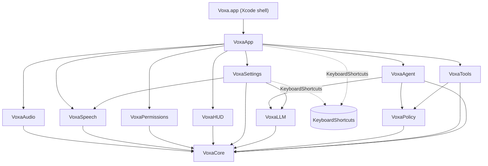

# Voxa design

This is the design record written before implementation and kept current milestone by milestone: module layout, key
protocols, the agent system prompt, and the risks and assumptions behind the decisions. The README covers usage; this
covers *why*.

## 1. Goals and non-goals

**Goal.** A menu-bar macOS app. The user holds a global hotkey, speaks a command, and an LLM with tool calling carries it
out on their Mac, then speaks and shows the result. Push-to-talk only; nothing listens in the background.

**Non-goals for v1.** Mac App Store distribution (Accessibility and Apple Events are impossible in the sandbox), an
arbitrary-shell tool, wake-word activation, cloud speech recognition.

## 2. Module layout

Every target is prefixed `Voxa`. (A module named `Speech` would shadow Apple's framework.) Dependencies point one way:
`VoxaCore` depends on nothing; capability modules depend on `VoxaCore` only; `VoxaApp` composes them; the Xcode app target
is a thin shell around `VoxaApp`.

```
voxa/
├─ Package.swift               libraries, the voxa-dev tool, tests (swift-tools 6.2, Swift 6 mode, ExistentialAny)
├─ project.yml, Voxa.xcodeproj  XcodeGen app shell: signing, hardened runtime, Info.plist, entitlements, icon
├─ App/                         VoxaMain.swift (@main), Info.plist, Voxa.entitlements, Assets.xcassets
├─ Sources/
│  ├─ VoxaCore/          shared kernel: AudioChunk, UserFacingError, L10n, Log, AppSettings, PermissionKind, HotkeyService,
│  │                     JSONValue, Schema, AgentTool/ToolResult/RiskLevel, ConfirmationPrompt, AuditEntry, JSONLAuditLog
│  ├─ VoxaAudio/         AudioCapturing, MicrophoneCapture (AVAudioEngine), SpeechFormatConverter, LevelMeter
│  ├─ VoxaSpeech/        SpeechRecognizer; SFSpeechRecognizer + SpeechAnalyzer engines; [M4] WhisperKit
│  ├─ VoxaPermissions/   PermissionsProviding, SystemPermissionsManager, System Settings deep links; [M3] all kinds
│  ├─ VoxaHUD/           non-activating NSPanel + SwiftUI HUD: listening, thinking, acting, confirmation card, reply
│  ├─ VoxaSettings/      SettingsStore, tabs (General, Model with the provider picker, Safety), window controller, Ollama status
│  ├─ VoxaLLM/    [M2]   Model clients over URLSession, one per provider (Claude, OpenAI, Ollama) behind RoutingLLMClient;
│  │                     shared streaming engine (SSE / NDJSON, retries, cancellation), request builders, key storage
│  ├─ VoxaPolicy/ [M2]   PolicyEngine, untrusted-data envelope, AppleScript and URL analyzers, voice yes/no parser
│  ├─ VoxaTools/  [M2]   open_app, open_url, list_shortcuts, run_shortcut, run_applescript; process runner   [M3-M4 add more]
│  ├─ VoxaAgent/  [M2]   AgentLoop, AgentService, ToolRegistry, ConversationMemory, system prompt + runtime context
│  ├─ VoxaApp/           composition root, VoiceSessionController, ConfirmationCoordinator, hotkey service, menu bar
│  ├─ VoxaDev/           developer CLI: transcribe, speech-status, hud-snapshots, system-prompt, ask, chat, ollama
│  └─ VoxaTestSupport/   ManualClock, fakes, ScriptedLLM, StubTool, MockHTTPTransport, SSE builders, TestSignal
├─ Tests/                        one test target per module
└─ scripts/                      build, sign, notarize, icon, window inspection, mock-llm-server.py, e2e-providers.sh
```



`VoxaAudit` and `VoxaFeedback` (audit viewer, TTS) arrive in M3 beside these, each depending only on `VoxaCore`. The audit
*writer* (`JSONLAuditLog`) already lives in `VoxaCore`.

## 3. Key protocols and types

```swift
// VoxaCore
enum RiskLevel: Int, Comparable, Codable, Sendable { case readOnly, reversible, sensitive }
struct AudioChunk: Sendable { samples: [Float]; sampleRate: Double /* 16 kHz mono */; startTime: TimeInterval }
struct UserFacingError: Error, Sendable { title; detail; recovery: RecoveryAction? }   // never fail silently
protocol AgentTool: Sendable {                                                          // M2
    var name, summary: String; var inputSchema: JSONValue; var baselineRisk: RiskLevel
    var requiredPermissions: Set<PermissionKind>
    func assess(_ input: JSONValue) throws -> ToolAssessment   // validation + risk + preview, written by the tool, never the model
    func execute(_ input: JSONValue, context: ToolContext) async throws -> ToolResult
}
struct ToolResult { content: [text|image]; isError: Bool; provenance: .trusted | .untrusted(source); undo: UndoDescriptor? }

// VoxaAudio / VoxaSpeech
protocol AudioCapturing: Sendable { func start() async throws -> AudioCaptureStreams; func stop() async }
protocol SpeechRecognizer: Sendable {
    func requiredPermissions(locale: Locale) async -> Set<PermissionKind>
    func prepare(locale: Locale) async throws
    func transcribe(_ audio: AsyncThrowingStream<AudioChunk, any Error>, locale: Locale)
        -> AsyncThrowingStream<Transcript, any Error>
}

// VoxaLLM. Raw URLSession: there is no official Swift SDK.
protocol LLMClient: Sendable { func stream(_ request: LLMRequest) -> AsyncThrowingStream<LLMStreamEvent, any Error> }

// VoxaPolicy / VoxaAgent
struct PolicyEngine: Sendable {   // pure: same call, same state, same answer
    func evaluate(toolName: String, baselineRisk: RiskLevel, assessment: ToolAssessment, taint: RunTaint) -> PolicyDecision
}
enum PolicyDecision { case allow, allowWithNotice(String), requireConfirmation(ConfirmationPrompt), deny(reason: String) }
protocol ConfirmationProviding: Sendable { func confirm(_ prompt: ConfirmationPrompt) async -> ConfirmationOutcome }
enum UntrustedData { static func wrap(_ text: String, source: String, ...) -> String }   // random-boundary envelope
struct AgentLoop { func run(command:, memory:, configuration:, context:, onEvent:) async -> Output }   // result + new memory
actor AgentService { func run(_ command: String, now: Date, onEvent: ...) async -> AgentRunResult }   // owns the conversation
struct AgentLimits { perToolTimeout = 30s; totalTimeout = 120s (not counting confirmations); maxDeclines = 2 }
```

## The agent loop

One spoken command becomes a loop of at most `maxAgentSteps` (default 12) model turns:

1. Send the conversation (static system prompt, tools sorted by name, the user turn with the time context) and stream the
   answer. Nothing runs until a *complete* message has arrived, so a failed or dropped request is always safe to repeat.
2. `end_turn`: the text is the reply. `refusal` and `max_tokens`: nothing is executed, even if the partial turn contained a
   tool call. `tool_use`: run the calls, in order, then send **all** their results back in one user message.
3. Each call passes through, in this order: valid JSON (else an `INVALID_JSON` error result, never a guess) → the tool
   exists and is enabled → **`InputValidator`** against the tool's own JSON Schema (`additionalProperties: false`, enums,
   ranges: an extra `"confirmed": true` is an error, not an option) → the tool's own `assess` → **`PolicyEngine`** →
   confirmation if required → execution with a per-tool timeout (abandoned, not awaited, if it hangs) → result.
4. A tool result that isn't Voxa's own text is wrapped in the untrusted-data envelope, and marks the conversation tainted.
5. Limits: a step cap, a per-tool timeout, a total timeout **paused while the user decides**, at most two declines per
   command, and cancellation at every await (Esc). A cut-short run keeps only a plain note of what already happened in the
   conversation, never a tool call without its result.

The conversation is **append-only** while it lives (that is what keeps the prompt cache and the model's signed reasoning
blocks valid) and is discarded whole when it goes stale (`followUpWindowSeconds`), when a setting that shapes the request
changes, or when it grows too long.

### Policy rules

- Effective risk is `max(tool baseline, tool.assess(input), PolicyFloors[tool])`. Nothing can *lower* a tier; the floors are
  the policy's own second opinion, so a tool that mislabels itself as harmless still asks.
- `.sensitive` always requires explicit confirmation, whatever the model says or claims the user said.
- **Taint.** Once untrusted data (script output, later clipboard, screen, files, web text) has been put in front of the
  model, `.reversible` tools also require confirmation, with the reason shown. The taint lasts as long as that content
  stays in the conversation (a whole follow-up session, not one command), because "act on this at the next command" is the
  obvious way past a per-command check. Reads stay allowed; an empty result doesn't taint.
- `strict` asks before every state change, `paranoid` before everything.
- Only the tool and the app decide risk; the model cannot pass a "risk" or "confirmed" argument (the schema forbids it).
- The confirmation shows what the *tool's code* says the call will do (title, exact arguments, target app, reasons), with
  invisible and text-direction characters made visible, so a model-written summary can never hide what will happen.
- `run_applescript` refuses, before anyone is asked: `do shell script`, `run script`, `load script`, Terminal/iTerm/Script
  Editor/Automator/Shortcuts Events/Keychain Access, Objective-C bridging, raw event codes, remote machines, `open location`,
  password-phishing dialogs, targets it can't read (`tell application (expression)`), invisible characters, unterminated
  quotes. It reads the script the way AppleScript does (comments, continued lines, strings; verified against `osascript`).
  **This is a speed bump, not a sandbox.** The real gate is the user reading the whole script.
- `open_url` allows web, mail, phone, message and map links only; blocks `file:`, custom schemes, credentials in the address,
  backslashes and encoded hosts; makes local-network and raw-IP addresses, look-alike (IDN) names and data-carrying
  addresses sensitive.

### Confirmation

Three ways at once, whichever comes first: the **Allow / Don't Allow** buttons, **⌘Return** (Esc stops the whole command),
or a spoken **yes / no** (hold the push-to-talk key and say it; only a whole, plain yes approves, anything else waits).
Silence for 60 seconds is a refusal. For the first 400 ms neither Allow nor ⌘Return works, and ⌘Return isn't even
registered as a global shortcut until then.

*Why ⌘Return and not Return:* a global shortcut swallows the keys it matches. In the first live test a plain Return, typed
for another reason, approved a pending action. The keyboard answer is now a chord that isn't typed by accident, and only
exists while a prompt is up.

### LLM client notes

Checked against the Claude API documentation while designing:

- Default model `claude-sonnet-5-5` (a setting). It rejects `thinking: {type: "disabled"}`, `budget_tokens`, non-default
  sampling parameters and forced `tool_choice`, so the request builder is **model-aware** and sends `effort` and
  adaptive thinking only where the model supports them, defaulting to the smallest request that works everywhere.
- The system prompt is byte-stable and marked for prompt caching; anything volatile (date and time) is placed in the user
  turn, so the cached prefix survives every step of every command.
- `stop_reason: "refusal"` is handled as a first-class outcome. Errors and SSE `error` events are retried with backoff
  (honoring `retry-after`) only while no side effect has happened.
- All `tool_result` blocks for one assistant turn go back in a single user message; skipped calls get an `is_error` result.

### Model providers

Claude, OpenAI and Ollama are three implementations of one small protocol (`LLMClient.stream(_:)`), chosen per request by
`RoutingLLMClient` from `LLMRequest.provider`. The agent loop, the policy and the tools only see neutral types (`LLMRequest`,
`ContentBlock`, `LLMStreamEvent`), so nothing above the client knows which service answered.

```
AgentLoop ──LLMRequest(provider, model, endpoint, contextLength)──▶ RoutingLLMClient ──▶ AnthropicClient
                                                                        │             ├▶ OpenAIClient
                                                                        │             └▶ OllamaClient
                                                                        └── wraps failures in ProviderFailure(provider, error)
each client = StreamingEngine (retries, backoff, cancellation, .restarted) + a wire session:
              request builder ─ what to send      stream translator ─ how to read it      error mapping ─ what went wrong
```

- **`StreamingEngine`** owns what every provider needs: the attempt loop, backoff honoring `retry-after`, cancellation that
  reaches the socket, and `.restarted` when a retry follows a partial answer. A provider supplies an `LLMWireSession`: how
  to build the request, how to decode the body (`SSEStreamDecoder` or `JSONLineStreamDecoder`), how to map an error, and
  `adapt(to:)`, which drops an optional parameter the server rejected and repeats the request.
- **Failures are worded for the service that failed** (`ProviderFailure` → "OpenAI is busy", "Ollama isn't running"), and
  recovery buttons go where the fix is: *Open Settings* lands on the Model tab, *Open Ollama* launches the app.
- **A conversation belongs to one provider.** The history fingerprint includes provider, address and context window, so
  switching starts fresh (Claude's signed thinking blocks mean nothing to another service).

**OpenAI** (Responses API, stateless):

- `POST {base}/responses` with `store: false`, `instructions`, `input` items and function tools with `strict: false` (the API
  defaults `strict` to true, which demands every property be required; Voxa's tools have optional arguments and validate
  their own input). `reasoning.effort` goes only to reasoning models, and is dropped and retried if the server refuses it.
- **Reasoning items are not replayed.** OpenAI recommends passing them back within a tool loop for best results, but a
  replayed reasoning item must keep its `id`, `encrypted_content` and following item as a matched set, and getting that wrong
  is a 400 on every multi-step command. Voxa keeps the simpler, robust form (function calls are sent without an `id`) and
  accepts slightly less continuity of reasoning between steps. Revisit this once it can be tried against a live key.
- **Message `phase`** (`commentary` before a tool call, `final_answer` for the closing answer) is sent back on assistant messages
  for `gpt-5.3` and later, as OpenAI asks ("dropping it can degrade performance"). It is reconstructed from the history's
  shape, and dropped and retried if a server refuses it.
- `insufficient_quota` (out of credit) is its own, non-retried error: it is a 429, but waiting won't fix it.
- The idle timeout is 60 s, because a reasoning model can be silent while it thinks.

**Ollama** (native `/api/chat`, newline-delimited JSON):

- The native API rather than the OpenAI-compatible one, because it takes what a voice assistant needs: `options.num_ctx`
  (Ollama's default context is small enough to silently cut off Voxa's prompt and tools), `keep_alive` (30 minutes, so only
  the first command pays the load time) and `think`.
- Tool calls arrive whole and have **no id**; Voxa makes one up (`call_<hex>`) so the result can be matched, and sends results
  back by `tool_name`. Tool-call arguments are an object, not a JSON string.
- `think` is negotiated per model from `/api/show` (cached for ten minutes): switchable models get `think: false` when the
  setting is *Quick*, named-level models get the matching level, others get nothing; a 400 that mentions thinking drops it.
- A model that can't call tools is reported by name ("gemma2:2b can't call tools…"), not as a generic failure; a missing
  model says how to install it; a server that isn't there says to open Ollama. A local model gets a five-minute clock per
  command instead of two, since it may have to load first.
- The address may be `http` on any host (the user's own home server, say): no key is sent, but the conversation is, so the
  choice is theirs. Cloud models (`remote_host` in `/api/tags`) are flagged, since they leave the Mac.

## 4. Agent system prompt

`Sources/VoxaAgent/Resources/AgentSystemPrompt.md` (print it with `swift run voxa-dev system-prompt`). It is loaded at
runtime, filled in with the step cap, and kept **static**. Tests pin the safety clauses so an edit can't silently drop one.
`RuntimeContext` renders the per-request facts (date, time zone, locale) as a block in the user turn.

## 5. Assumptions and decisions

| # | Decision | Why |
|---|----------|-----|
| A1 | The app is built by an Xcode project (XcodeGen) over the local Swift package; unit tests run with `swift test`. | SwiftPM's command-line resource accessor looks for resource bundles at the *root* of an `.app`, which code signing rejects; KeyboardShortcuts would crash on any machine but the build machine. Xcode places bundles in `Contents/Resources` and finds them. Verified with a spike. |
| A2 | Bundle ID `com.rohitsainier.voxa`, team `79Q9WFF2X8` (from the Developer ID certificate), default shortcut hold ⌥Space. | Placeholders in one place each (`project.yml`, `scripts/config.sh`). |
| A3 | Speech is always on-device. `SpeechAnalyzer` (macOS 26) is used when its model is installed, otherwise `SFSpeechRecognizer` forced on-device. If the language has no on-device model the app **errors with a fix** instead of falling back to Apple's servers. | Voice is sensitive; silent cloud fallback would break the promise in the permission prompt. |
| A4 | The newer model downloads in the background on first use (toggle in Settings). | Better accuracy from the second command on; opt-out for metered connections. |
| A5 | `run_applescript` runs out of process via `osascript` (script on stdin) with a timeout, a minimal environment and an output cap. | `NSAppleScript` runs on the main thread and cannot be timed out or killed. A sandboxed XPC helper is a later hardening. |
| A6 | No SwiftPM resources in modules except `VoxaAgent` (prompt). Localized strings use natural-language keys resolved against the app bundle. | Fewer resource-bundle lookups to get wrong. |
| A7 | Window sizing never goes through Auto Layout (see below). | A crash found in testing. |
| A8 | Each API key (Claude, OpenAI) lives in the Keychain only, one entry per provider (`kSecAttrAccessibleWhenUnlockedThisDeviceOnly`, never synced). Development builds may take throwaway keys, a base URL and a separate preferences domain from the environment; Release builds ignore all of them. The app never reads `OPENAI_API_KEY` from its environment (a GUI app doesn't inherit the shell's, and a key in the environment leaks to child processes); only `voxa-dev` does. | A key in preferences, logs or a file is a leak waiting to happen. |
| A9 | For a provider that takes a key (Claude, OpenAI) the base URL must be `https`, or `http` to loopback. Anything else silently becomes that provider's own endpoint. Ollama takes no key, so its address may be `http` anywhere. | A bad setting must never send a key to an arbitrary host. |
| A10 | Taint lasts for the conversation, not one command. | The model still holds the untrusted text; see "Policy rules". |
| A11 | `swift format` (the Xcode toolchain's) is used for wrapping; SwiftFormat isn't installed here. | One argument per line when wrapped, as the SwiftLint rule wants. |

### Lesson: never let SwiftUI size a window through Auto Layout on macOS 26

`NSHostingController.sizingOptions = [.preferredContentSize]` makes AppKit resize the window from constraints inside its
layout pass. On macOS 26 `NSHostingView` reacts to that frame change (`invalidateSafeAreaCornerInsets`) by requesting a
constraints update *during* the layout pass, and AppKit throws. Opening Settings crashed the app. Both windows now use a
plain `NSHostingView` with `sizingOptions = []`: Settings has a fixed content size, and the HUD reports its size through a
SwiftUI preference and is resized one main-actor turn later, outside the layout pass. A SwiftLint custom rule
(`no_constraint_driven_window_sizing`) fails the lint if the pattern comes back.

### Lesson: don't poll the keyboard to "help" push-to-talk

M1 shipped a "release watchdog": while the shortcut was held it polled `CGEventSource.keyState` and synthesized a key-up
if the key read as up. Without Input Monitoring permission macOS reports every key as up, so the watchdog released every
hold about 100 ms after the press, below the tap threshold, and the HUD flashed and vanished. Unit tests passed because
they injected the key-state check. It was found in the real app's log (`/usr/bin/log show`, subsystem
`com.rohitsainier.voxa`). The watchdog is gone; the hotkey service is a pass-through with a log breadcrumb per event. A
regression test pins that a held key is never released until the real key-up arrives, and a tap now shows a "hold the
shortcut" hint instead of vanishing.

### Lesson: a ScrollView inside a fixed-size window never lets the window grow

The confirmation card holds a scrolling details box. In the live app the panel stayed at its previous height and clipped
the buttons, while an offscreen render (which proposes "no size") looked right. A hosting view proposes its *current* size,
and a flexible child (ScrollView) shrinks to fit it, so the size never grew. The HUD root is now `fixedSize(vertical:)`, so
its height is its content's natural height. Unit tests can't see this (SwiftUI layout is inert in the test process): it is
checked by pinning each HUD state in the real app and reading the panel's frame (`swift scripts/window-info.swift Voxa`).

### Lesson: a global "Return" approves things you didn't mean to

See "Confirmation". Found because a pending prompt was approved about ten seconds after it appeared, with nothing scripted.

### Lesson: test the failure you can't provoke on demand

The mock model server (`scripts/mock-llm-server.py`, which speaks Claude's, OpenAI's and Ollama's APIs) validates every
request the way the real service would (headers, tool-result adjacency, sorted tools, parameters the newest models reject)
and provokes 401, 529, a dropped stream and a refusal. It showed that a stalled connection waited a full minute before retrying (now 30 s) and confirmed that a truly
dropped one retries in about two seconds.

### Lesson: fakes hid that "open Safari" couldn't work

Every `open_app` test passed against a fake app list. Run once against the real one, Safari wasn't found: on macOS 26 its
entry in `/Applications` is a *hidden-flagged symlink* into a system volume, and the scan used `.skipsHiddenFiles`. The same
run showed the login window (and other `LSUIElement` helpers in `/System/Library/CoreServices`) leaking into the list. The
scan now keeps hidden-flagged entries (skipping only dot-names), takes only Finder from CoreServices, and a test runs the
real catalog. Any tool that reads the real system should have at least one test that does.

## 6. Risks

| # | Risk | Mitigation |
|---|------|------------|
| R1 | Ad-hoc signing changes the code hash on every rebuild, so TCC re-prompts. | Sign development builds with the Developer ID identity (`scripts/build.sh --sign-dev`). |
| R2 | Carbon hotkeys can't be modifier-only, can lose a key-up (secure input, modifiers released first), and another app may already own the shortcut. | Events are forwarded as delivered and the session controller tolerates duplicates and missing releases (a stuck session ends at the recording limit or with Esc). Esc is registered only while a session needs it; conflicts are surfaced by the recorder. **No key-state polling**, see the lesson below. |
| R3 | AirPods switching to the hands-free profile mid-start changes the audio format and stops the engine. | Tap format `nil`, converter rebuilt per format, engine restarted on configuration change. |
| R4 | Prompt injection via screen, clipboard, web or script output, and **audio injection** (other voices reaching the mic). | Push-to-talk only (a spoken confirmation needs the hold too); untrusted-data envelope with a random boundary, invisible characters stripped; taint escalation; mandatory confirmation built from the tool's own description; injection tests at the policy, loop and live-app level; audit log. |
| R5 | The app is not sandboxed (Accessibility and Apple Events need that), so the policy engine is the security boundary. | Deny-by-default patterns, exhaustive policy tests, append-only audit log. |
| R6 | Swift 6 strict concurrency versus AVFoundation and Speech types that aren't `Sendable`. | Confined to actors or small `@unchecked Sendable` boxes, each documented and lock-protected. |
| R7 | Speech and audio behavior that can only be verified with real hardware and permissions. | Manual QA checklist in the README; `voxa-dev` exercises engines without a person. |
| R8 | The real APIs' behavior (streaming edge cases, model-specific parameters) can't be exercised without a key. | Request shapes are pinned against the documented rules in tests and a validating mock server; the first real run is on the manual QA list. **OpenAI in particular has not yet been run against the live API**; Ollama has, with a model that can't use tools (which exercises discovery, streaming and its errors), but not yet with a tool-capable one. |
| R9 | AppleScript is a general-purpose language; no static check proves a script safe. | Always sensitive; the user reads the whole script; a reader that matches AppleScript's own parsing refuses the known routes to a shell; out of process with a timeout. |

## 7. Milestones

| | Scope | Status |
|-|-------|--------|
| M1 | Menu-bar shell, hotkey, audio capture, Apple STT, HUD with live transcript | done |
| M2 | LLMClient, agent loop, open_app / open_url / run_shortcut / run_applescript, policy engine, confirmation HUD | done |
| M3 | PermissionsManager + onboarding, calendar / reminders / clipboard / context tools, TTS, full settings, audit log | |
| M4 | Accessibility UI tools, screenshot + vision fallback, WhisperKit engine | |
| M5 | Hardening, tests, signing and notarization scripts, README, DMG | |
